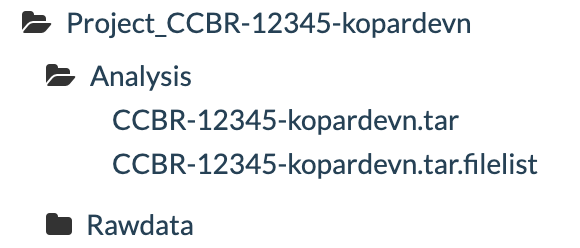

<!-- TOC -->

- [1. Background](#1-background)
- [2. parkit](#2-parkit)
  - [2.1. `projark` usage](#21-projark-usage)
  - [2.2. `projark` testing](#22-projark-testing)
    - [get dummy data](#get-dummy-data)
    - [load conda env](#load-conda-env)
    - [run `projark`](#run-projark)
    - [verify transfer](#verify-transfer)
    - [cleanup](#cleanup)

<!-- /TOC -->

###  1. <a name='Background'></a>Background

Rawdata or Project folders from Biowulf can be parked at a secure location after the analysis has reached an endpoint. Traditionally, CCBR analysts have been using GridFTP Globus Archive for doing this. But, this Globus Archive has been running relatively full lately and it is hard to estimate how much space is left there as the volume is shared among multiple groups.

###  2. <a name='parkit'></a>parkit

[**parkit**](https://github.com/CCBR/parkit) is designed to assist analysts in archiving project data from the NIH's Biowulf/Helix systems to the HPC-DME storage platform. It provides functionalities to package and store data such as raw FastQ files or processed data from bioinformatics pipelines. Users can automatically:
- create tarballs of their data (including `.filelist` and `.md5sum` files), 
- generate metadata, 
- create collections on HPC-DME, and 
- deposit tar files into the system for long-term storage. 
**parkit** also features comprehensive workflows that support both folder-based and tarball-based archiving. These workflows are integrated with the SLURM job scheduler, enabling efficient execution of archival tasks on the Biowulf HPC cluster. This integration ensures that bioinformatics project data is securely archived and well-organized, allowing for seamless long-term storage.

> :exclamation: **NOTE**: HPC DME API CLUs should already be setup as per [these](https://ccbr.github.io/HowTos/HPCDME/setup/) instructions in order to use **parkit**

> :exclamation: **NOTE**: `HPC_DM_UTILS` environment variable should be set to point to the `utils` folder under the `HPC_DME_APIs` repo setup. Please see [these](https://ccbr.github.io/HowTos/HPCDME/setup/#edit-bashrc) instructions.

[`projark`](https://github.com/CCBR/parkit) is the preferred **parkit** command to completely archive an entire folder as a tarball on HPCDME using SLURM.

####  2.1. <a name='projarkusage'></a>`projark` usage

```bash
projark --help
```
<details>
  <summary><em>Expected sample output</em></summary>

```bash
usage: projark [-h] --folder FOLDER --projectnumber PROJECTNUMBER
               [--executor EXECUTOR] [--rawdata] [--cleanup]

Wrapper for folder2hpcdme for quick CCBR project archiving!

options:
  -h, --help            show this help message and exit
  --folder FOLDER       Input folder path to archive
  --projectnumber PROJECTNUMBER
                        CCBR project number.. destination will be
                        /CCBR_Archive/GRIDFTP/Project_CCBR-<projectnumber>
  --executor EXECUTOR   slurm or local
  --rawdata             If tarball is rawdata and needs to go under folder
                        Rawdata
  --cleanup             post transfer step to delete local files
```

</details>

####  2.2. <a name='projarktest'></a>`projark` testing

##### get dummy data

```bash
# make a tmp folder
mkdir -p /data/$USER/parkit_tmp
# copy dummy project folder into the tmp folder
cp -r /data/CCBR/projects/CCBR-12345 /data/$USER/parkit_tmp/CCBR-12345-$USER
# check if HPC_DM_UTILS has been set
echo $HPC_DM_UTILS
```

##### load conda env

```bash
# source conda
. "/data/CCBR_Pipeliner/db/PipeDB/Conda/etc/profile.d/conda.sh"
# activate parkit or parkit_dev environment
conda activate parkit
# check version of parkit
parkit --version
projark --version
```

<details>
  <summary><em>Expected sample output</em></summary>

```bash
v2.0.2-dev
projark is using the following parkit version:
v2.0.2-dev
```
</details>

##### run `projark`

```bash
projark --folder /data/$USER/parkit_tmp/CCBR-12345-$USER --projectnumber 12345-$USER --executor local
```

<details>
  <summary><em>Expected sample output</em></summary>

```bash
SOURCE_CONDA_CMD is set to: . "/data/CCBR_Pipeliner/db/PipeDB/Conda/etc/profile.d/conda.sh"
HPC_DM_UTILS is set to: /data/kopardevn/GitRepos/HPC_DME_APIs/utils
parkit_folder2hpcdme --folder "/data/$USER/parkit_tmp/CCBR-12345-$USER" --dest "/CCBR_Archive/GRIDFTP/Project_CCBR-12345-kopardevn" --projecttitle "CCBR-12345-kopardevn" --projectdesc "CCBR-12345-kopardevn" --executor "local" --hpcdmutilspath /data/kopardevn/GitRepos/HPC_DME_APIs/utils --makereadme
################ Running createtar #############################
parkit createtar --folder "/data/$USER/parkit_tmp/CCBR-12345-$USER"
tar cvf /data/$USER/parkit_tmp/CCBR-12345-$USER.tar /data/$USER/parkit_tmp/CCBR-12345-$USER > /data/$USER/parkit_tmp/CCBR-12345-$USER.tar.filelist
createmetadata: /data/$USER/parkit_tmp/CCBR-12345-$USER.tar file was created!
createmetadata: /data/$USER/parkit_tmp/CCBR-12345-$USER.tar.filelist file was created!
createmetadata: /data/$USER/parkit_tmp/CCBR-12345-$USER.tar.md5 file was created!
createmetadata: /data/$USER/parkit_tmp/CCBR-12345-$USER.tar.filelist.md5 file was created!
################################################################
############ Running createemptycollection ######################
parkit createemptycollection --dest "/CCBR_Archive/GRIDFTP/Project_CCBR-12345-kopardevn" --projectdesc "CCBR-12345-kopardevn" --projecttitle "CCBR-12345-kopardevn"
module load java/11.0.21 && source $HPC_DM_UTILS/functions && dm_register_collection /dev/shm/a213dedc-9363-44ec-8a7a-d29f2345a0b5.json /CCBR_Archive/GRIDFTP/Project_CCBR-12345-kopardevn
cat /dev/shm/a213dedc-9363-44ec-8a7a-d29f2345a0b5.json && rm -f /dev/shm/a213dedc-9363-44ec-8a7a-d29f2345a0b5.json
module load java/11.0.21 && source $HPC_DM_UTILS/functions && dm_register_collection /dev/shm/cabf7826-81b5-4b6a-addd-09fbcf279591.json /CCBR_Archive/GRIDFTP/Project_CCBR-12345-kopardevn/Analysis
module load java/11.0.21 && source $HPC_DM_UTILS/functions && dm_register_collection /dev/shm/cabf7826-81b5-4b6a-addd-09fbcf279591.json /CCBR_Archive/GRIDFTP/Project_CCBR-12345-kopardevn/Rawdata
cat /dev/shm/cabf7826-81b5-4b6a-addd-09fbcf279591.json && rm -f /dev/shm/cabf7826-81b5-4b6a-addd-09fbcf279591.json
################################################################
########### Running createmetadata ##############################
parkit createmetadata --tarball "/data/$USER/parkit_tmp/CCBR-12345-$USER.tar" --dest "/CCBR_Archive/GRIDFTP/Project_CCBR-12345-kopardevn"
createmetadata: /data/$USER/parkit_tmp/CCBR-12345-$USER.tar.metadata.json file was created!
createmetadata: /data/$USER/parkit_tmp/CCBR-12345-$USER.tar.filelist.metadata.json file was created!
################################################################
############# Running deposittar ###############################
parkit deposittar --tarball "/data/$USER/parkit_tmp/CCBR-12345-$USER.tar" --dest "/CCBR_Archive/GRIDFTP/Project_CCBR-12345-kopardevn"
module load java/11.0.21 && source $HPC_DM_UTILS/functions && dm_register_dataobject /data/$USER/parkit_tmp/CCBR-12345-$USER.tar.filelist.metadata.json /CCBR_Archive/GRIDFTP/Project_CCBR-12345-kopardevn/Analysis/CCBR-12345.tar.filelist /data/$USER/parkit_tmp/CCBR-12345-$USER.tar.filelist
module load java/11.0.21 && source $HPC_DM_UTILS/functions && dm_register_dataobject_multipart /data/$USER/parkit_tmp/CCBR-12345-$USER.tar.metadata.json /CCBR_Archive/GRIDFTP/Project_CCBR-12345-kopardevn/Analysis/CCBR-12345.tar /data/$USER/parkit_tmp/CCBR-12345-$USER.tar
################################################################
```

</details>

> :exclamation: **NOTE**: remove `--executor local` from the command when running on real data (not test data) to submit jobs through SLURM

> :exclamation: **NOTE**: add `--rawdata` when folder contains raw fastqs

##### verify transfer

Transfer can be verified by logging into [HPC DME web interface](https://hpcdmeweb.nci.nih.gov/browse?base).



##### cleanup

Delete unwanted collection from HPC DME.

```bash
# load java
module load java
# load dm_ commands
source $HPC_DM_UTILS/functions
# delete collection recursively
dm_delete_collection -r /CCBR_Archive/GRIDFTP/Project_CCBR-12345-$USER
```

<details>
  <summary><em>Expected sample output</em></summary>

```bash
Reading properties from /data/kopardevn/GitRepos/HPC_DME_APIs/utils/hpcdme.properties
WARNING: You have requested recursive delete of the collection. This will delete all files and sub-collections within it recursively. Are you sure you want to proceed? (Y/N):
Y
Would you like to see the list of files to delete ?
N
The collection /CCBR_Archive/GRIDFTP/Project_CCBR-12345-kopardevn and all files and sub-collections within it will be recursively deleted. Proceed with deletion ? (Y/N):
Y
Executing: https://hpcdmeapi.nci.nih.gov:8080/collection
Wrote results into /data/kopardevn/HPCDMELOG/tmp/getCollections_Records20241010.txt
Cmd process Completed
Oct 10, 2024 4:43:09 PM org.springframework.shell.core.AbstractShell handleExecutionResult
INFO: CLI_SUCCESS
```

</details>

> :warning: Reach out to [Vishal Koparde](mailto:vishal.koparde@nih.gov) in case you run into issues.


