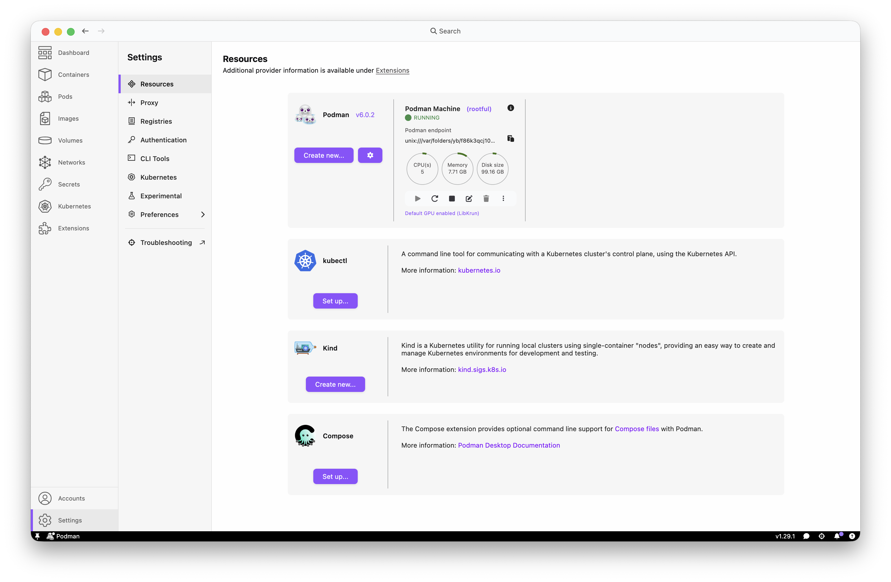

## Containers as development environments

<https://containers.dev/>

<https://rocker-project.org/use/editor.html>

## Podman

install podman

create new podman machine

increase the default resource allocation

machine is now running

## Positron

First, follow the instructions in positron's documentation to enable development containers:
<https://positron.posit.co/dev-containers.html>

## VS Code

<https://code.visualstudio.com/docs/devcontainers/containers>
<https://code.visualstudio.com/docs/devcontainers/tutorial>

Install Dev Containers extension

## VS Code + Positron

Change settings to use podman instead of docker

disconnect from your vpn -- it interferes with pulling the container

command palette - `Reopen in container`
