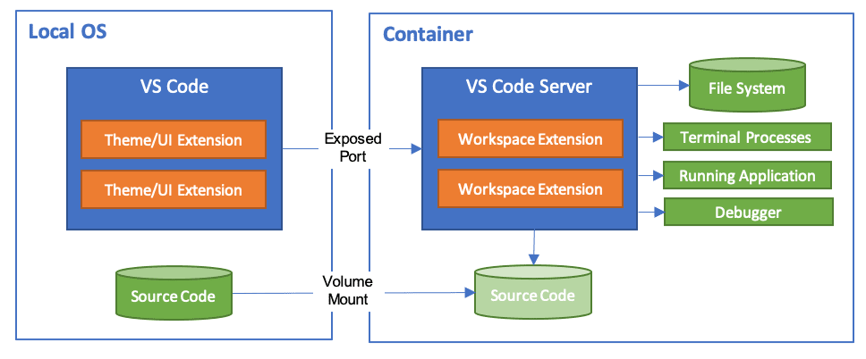
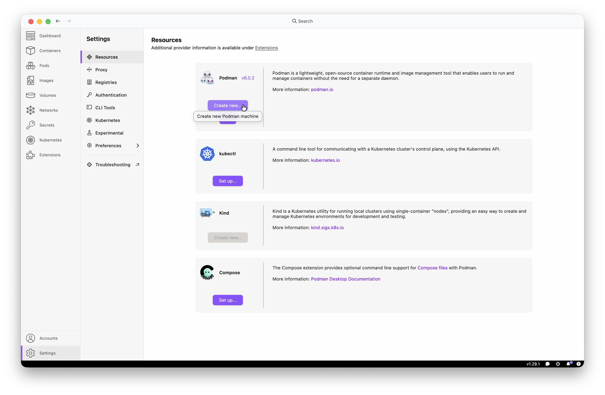
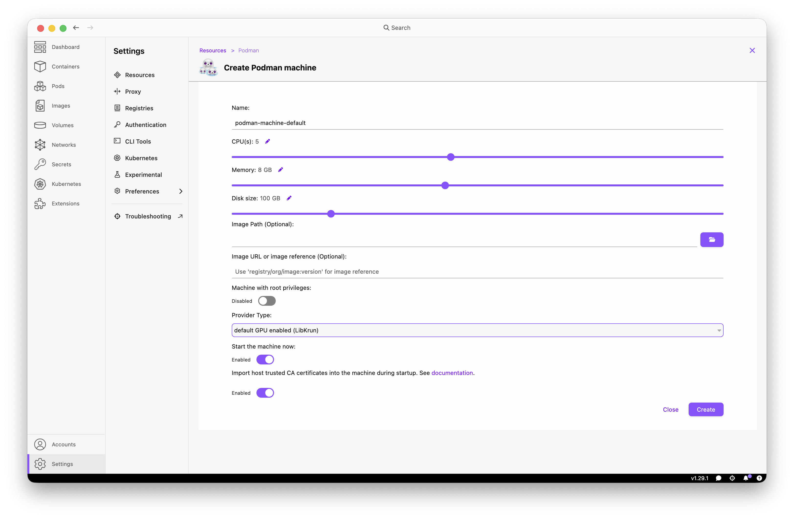
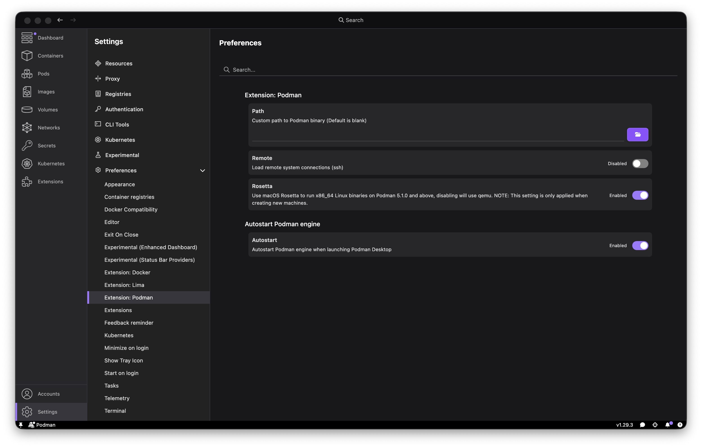
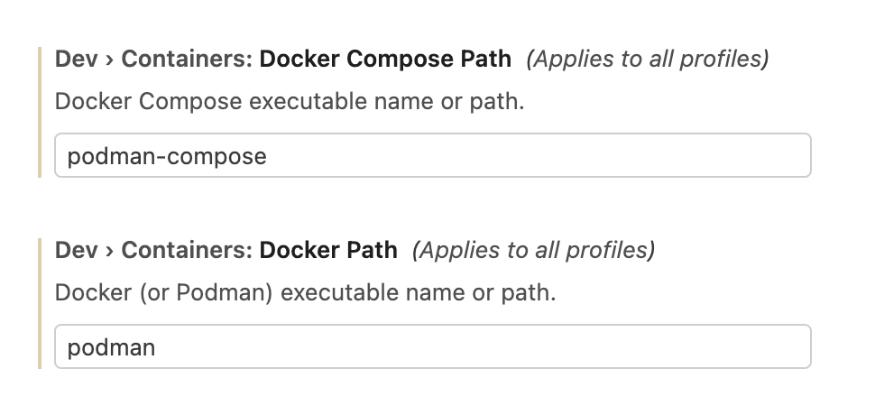
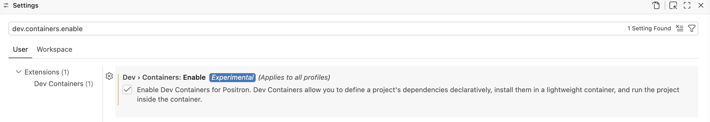

## Agenda

## Installers & dependency managers

|                         | language | environments |
|-------------------------|----------|--------------|
| pip                     | python   | ❌ |
| uv, venv, pyenv         | python   | ✅ |
| `install.packages`, pak | R        | ❌ |
| renv                    | R        | ✅ |
| conda, mamba            | polyglot | ✅ |
| pixi                    | polyglot | ✅ |

## Separate environments per project for reproducibility

::: {.column}
```
projects
├── CCBR-abc
├── CCBR-xyz
├── cool-python-package
└── RStatsPackage
```
:::

## Separate environments per project for reproducibility


::: {.column}
```
projects
├── CCBR-abc
│   └── environment.yml
├── CCBR-xyz
│   ├── data-integration
│   │   └── env.yml
│   └── figures
│       └── env.yml
├── cool-python-package
│   └── pyproject.toml
└── RStatsPackage
    └── renv.lock
```
:::

::: {.column .fragment}
- Each project specifies its own package versions.
- Can use different environment managers for different projects.
- Keep configuration in git so it is version controlled & shared with others.
:::

## Containers handle dependencies at the OS level

::: {.column }
#### Package managers

Install dependency versions on your local machine.

There can be slight differences in compiled versions of software depending on the hardware and operating system.
:::

::: {.column}
#### Containers

Container images ship with exact versions of dependencies already compiled and installed for a specific OS.
:::

## Containers as development environments

[](https://code.visualstudio.com/docs/devcontainers/containers#_quick-start-open-an-existing-folder-in-a-container)

## Why use dev containers?

- Dependency management, including IDE extensions
- Consistent dependency versions across collaborators
- Keep genAI tools in a sandbox for security

:::{.fragment}
### Why _not_?

- Heavier disk usage
- Building takes time
- Not user-friendly
:::

::: {.notes}
- e.g. conda envs can share package versions across environments, containers can't
:::

## Container engines

- Docker - Industry standard, but not available on Biowulf or GFE due to security concerns.
- Singularity/Apptainer - Available on Biowulf, not on macOS.
- Podman - Available on macOS, not currently on Biowulf. Drop-in replacement for docker. Rootless by default.

|                           | Biowulf HPC | GFE macOS |   |
|---------------------------|-------------|-----------|---|
| Docker                    | ❌          |  ❌        | Industry standard, but CBIIT won't allow Docker on macOS due to security concerns.    |
| Singularity/Apptainer     | ✅          |  ❌        | Great for HPC, doesn't support macOS. CLI not exactly identical to docker.            |
| Podman                    | ❌          | ✅         | Could be installed on Biowulf in the future. CLI is a drop-in replacement for docker. |

:::{.notes}
- Docker runs containers with root privileges. Podman, singularity, and apptainer don't have this glaring security risk.
- Podman is a drop-in replacement for docker. Rootless by default.
:::

## Podman


## Podman



## Podman



## Podman


## Podman



## VS Code


Install Dev Containers extension

use full path to podman `/opt/podman/bin/podman`


Change settings to use podman instead of docker



disconnect from your vpn -- it interferes with pulling the container

command palette - `Reopen in container`

## Dev container configuration file

`.devcontainer/devcontainer.json`

```json
{
    "image": "nciccbr/mosuite-dev:v0.5.0.9000"
}
```

## Dev container features

> Development container "Features" are self-contained, shareable units of
> installation code and dev container configuration. The name comes from the idea
> that referencing one of them allows you to quickly and easily add more tooling,
> runtime, or library "Features" into your development container for use by you or
> your collaborators.

[VS Code docs - dev container features](https://code.visualstudio.com/docs/devcontainers/containers#_dev-container-features)

## Project organization

One dev container per repo, or create workspace with repos in subdirs.

## Positron

Positron supports dev containers!

...but I haven't gotten it to work...

Instructions in positron's documentation to enable development containers:
<https://positron.posit.co/dev-containers.html>



## Biowulf

- [You can open dev containers on a remote host over ssh.](https://code.visualstudio.com/docs/devcontainers/containers#_open-a-folder-on-a-remote-ssh-host-in-a-container)
- But the dev container extension does not yet support singularity (see [microsoft/vscode-remote-release#3066](https://github.com/microsoft/vscode-remote-release/issues/3066)).
- This will probably work if the HPC staff make podman available on biowulf.

## Resources

- Dev Containers extension for VS Code: https://code.visualstudio.com/docs/devcontainers/containers
  - Tutorial: <https://code.visualstudio.com/docs/devcontainers/tutorial>
- The rocker project - containers for R: https://rocker-project.org/use/editor.html#visual-studio-code-dev-containers
- Development containers specification: https://containers.dev/
