## Installers & dependency managers

|                         | language | environments |
|-------------------------|----------|--------------|
| pip                     | python   | ❌ |
| uv, venv, pyenv         | python   | ✅ |
| `install.packages`, pak | R        | ❌ |
| renv                    | R        | ✅ |
| conda, mamba            | polyglot | ✅ |
| pixi                    | polyglot | ✅ |

:::{.notes}
There's no one dependency management tool to rule them all.
They all have their strengths and weaknesses.
:::

## Separate environments per project for reproducibility {.x-large-text}

&nbsp;

::: {.column width="40%"}
```{.md}
~/projects
├── CCBR-abc
├── CCBR-xyz
├── cool-python-package
└── RStatsPackage
```
:::

## Separate environments per project for reproducibility {.x-large-text}

&nbsp;

::: {.column width="40%"}
```{.md}
~/projects
├── CCBR-abc
│   └── environment.yml
├── CCBR-xyz
│   ├── data-integration
│   │   └── env.yml
│   └── figures
│       └── env.yml
├── cool-python-package
│   └── pyproject.toml
└── RStatsPackage
    └── renv.lock
```
:::

:::{.column width="5%"}
:::

::: {.column width="50%" .fragment}
- Each project specifies its own package versions.
- Can use different environment managers for different projects.
- Keep configuration in git so it is version-controlled & shared with others.
:::

## Containers handle dependencies at the OS level

::: {.column width="45%"}
### Package managers

**Install dependency versions on your local machine.**

There can be slight differences in compiled versions of software depending on the hardware and operating system.
:::

::: {.column width="5%"}
:::

::: {.column width="45%"}
### Containers

**Ship with exact versions of dependencies already compiled and installed for a specific OS.**

Extremely useful for pipelines; each step gets its own container. Users don't have to worry about installing dependencies.
:::

:::{.notes}
TODO show how we're using containers in smk & nxf pipelines, also mosuite code ocean capsules
:::

## Containers as development environments

[](https://code.visualstudio.com/docs/devcontainers/containers)

::: footer
Architecture of Dev Containers. Source: <https://code.visualstudio.com/docs/devcontainers/containers>
:::

:::{.notes}
TODO Dev Containers logo?
:::

## Why use Dev Containers?

- Dependency management for developers, including IDE extensions.
- Consistent dependency versions across collaborators.
- Keep genAI tools in a sandbox for security.

:::{.fragment}
### Why _not_?

- Heavier disk usage.
- Building takes time.
- Not user-friendly.
- Not intended for _users_, only _contributors_.
  - Still need to have adequate documentation of dependencies for users.
:::

::: {.notes}
- e.g. conda envs can share package versions across environments, containers can't
:::

## Container engines

|           | Biowulf HPC | GFE macOS |                               |
|-----------|---|---|-------------------------------|
|  | ❌          |  ❌        | Industry standard, but incompatible with HPC due to root privileges. CBIIT won't allow Docker on macOS due to security concerns.   |
|  {width="50px"} | ✅          |  ❌        | Great for HPC, doesn't support macOS. CLI not exactly identical to docker, but generally compatible.       |
|  | ❌          | ✅         | Could be installed on Biowulf in the future. CLI is a drop-in replacement for docker. Rootless by default. |

:::{.notes}
- Docker runs containers with root privileges. Podman, singularity, and apptainer don't have this glaring security risk.
- Singularity history: Singularity was renamed to Apptainer and maintained by the Linux Foundation, then there was a fork of Apptainer to create SingularityCE by Sylabs.
:::

## How to use Dev Containers on macOS

1. Install podman.
1. Set up Dev Containers in VS Code.
1. Configure Dev Containers for your projects.

## Podman

:::{.align-center}
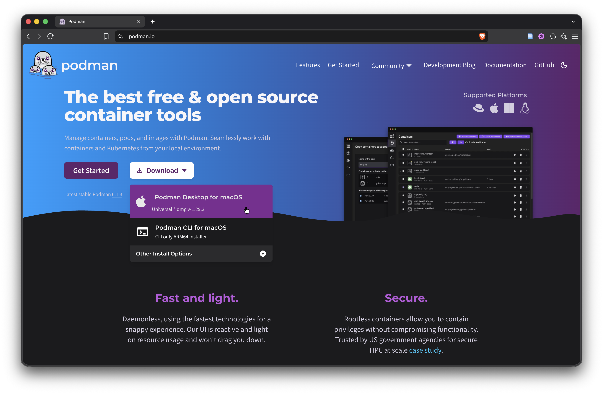{width="85%"}
:::

::: footer
Download Podman Desktop from [`podman.io`](https://podman.io)
:::

## Podman

:::{.align-center}
{width="90%"}
:::

::: footer
Install and open Podman Desktop
:::

## Podman

:::{.align-center}
{width="90%"}
:::

::: footer
Create new podman machine
:::

## Podman

:::{.align-center}
{width="90%"}
:::

::: footer
Increase the default resource allocation. Make sure it is rootless!
:::

## Podman

:::{.align-center}
{width="90%"}
:::

::: footer
Machine is now running
:::

## Podman

:::{.align-center}
{width="90%"}
:::

::: footer
Optional: auto-start the machine when podman starts
:::

## Podman

:::{.align-center}
{width="90%"}
:::

::: footer
Optional: start podman when you login.
Consider toggling on if you use podman daily, or toggle it off if you use it sparingly.
:::

## Podman CLI

:::{.column width="80%"}
:::{.x-large-text}
Optional: you can configure the default machine and start it via the Podman CLI rather than the Desktop
:::

```{.sh filename="Terminal"}
podman machine set --cpus 4 --disk-size 100 --memory 8192 --rootful=false
podman machine start
```
:::

## VS Code

:::{.align-center}
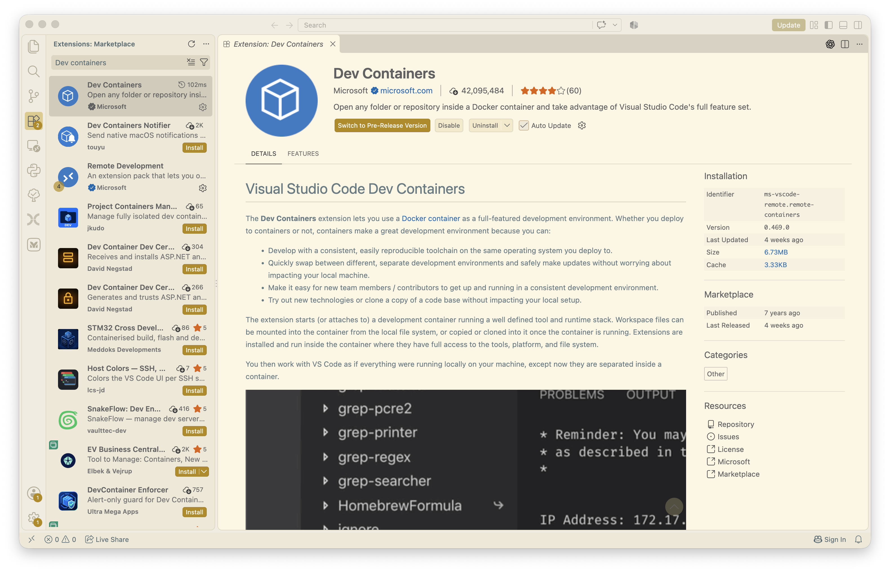{width="90%"}
:::

::: footer
Install the Dev Containers extension
:::

## VS Code

:::{.large-text}
- Open VS Code settings 
- Search for "Dev Containers" and scroll down to **Docker Compose** & **Docker Path**.
- Set **Docker Compose** to `podman-compose`
- Set **Docker Path** to full path to podman (`which podman` ➡️ `/opt/podman/bin/podman`)
:::

:::{.align-center}
{width="90%"}
:::

::: footer
Change settings to use podman instead of docker
:::

## Open a project in VS Code

:::{.large-text}
`File` > `Open` or 
:::

:::{.align-center}
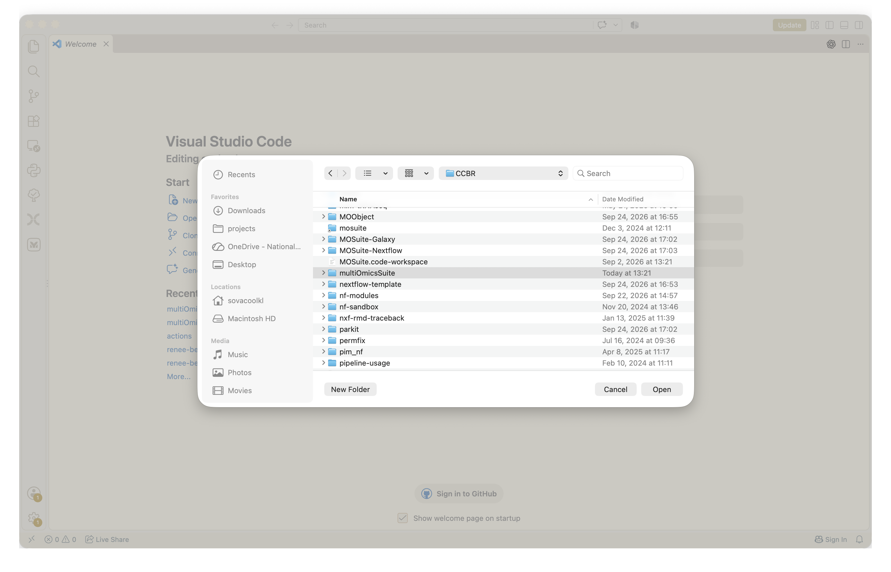{width="90%"}
:::

## Create a basic Dev Container configuration file

:::{.column width="9%"}
:::

:::{.column width="50%"}
```{.json filename=".devcontainer/devcontainer.json"}
{
    "image": "nciccbr/mosuite-dev:v0.5.0.9000"
}
```
:::

:::{.align-center}
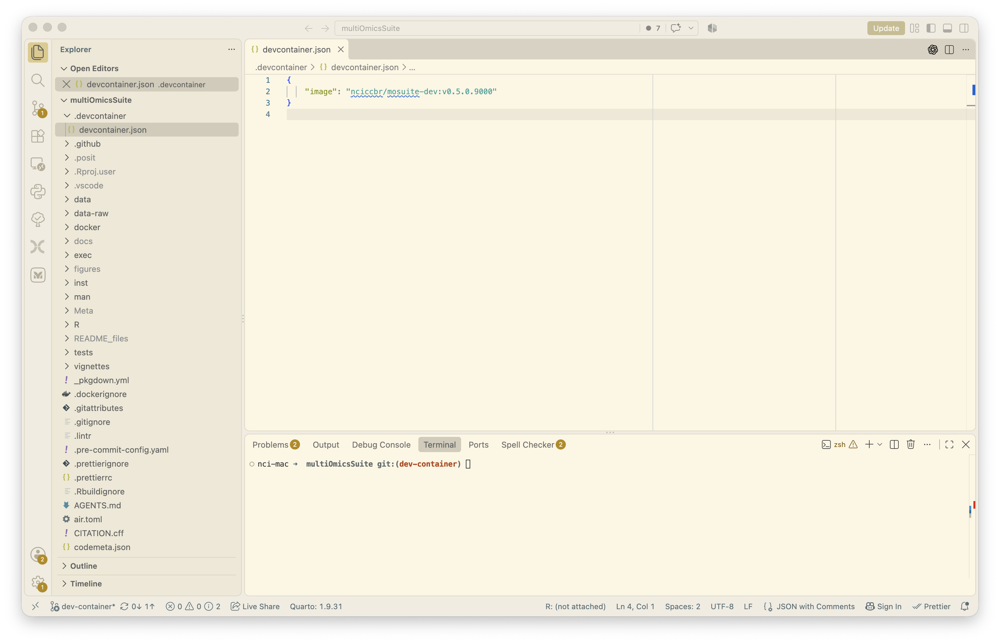{width="90%"}
:::

## Start the Dev Container {.x-large-text}


:::{.column width="45%" .large-text}
- Open the VS Code command palette: 
- Select **`Dev Containers: Reopen in Container`**
:::

:::{.align-center}
{width="90%"}
:::

:::{.column width="45%" .callout-tip .fragment}
Disconnect from the VPN when pulling a base container for the first time -- it may interfere with the download.
:::

## Start the Dev Container {.x-large-text}

:::{.align-center}

{width="80%"}
:::

::: footer
It will take some time to build the container the first time. After that it will cache the image and perform much faster.
:::

## Start the Dev Container {.x-large-text}

:::{.align-center}
{width="80%"}
:::

:::{.large-text}
- You'll have all of the dependencies installed in the container available to use during development and testing.
- Podman mounts the project directory to the container, and those are the only files that can be edited in the VS Code session.
:::

## Dev Container from local dockerfile

:::{.column width="45%"}
Container image from a registry:

```{.json filename="devcontainer.json"}
{
    "image": "nciccbr/mosuite-dev:v0.5.0.9000"
}
```
:::

:::{.column width="5%"}
:::

:::{.column width="45%"}
Container image built from a local file:

```{.json filename="devcontainer.json"}
{
  "build": {
    "dockerfile": "../docker/Dockerfile-dev",
    "context": ".."
  }
}
```
:::

&nbsp;

:::{.column width="96%" .x-large-text}
**Benefit of building from a local Dockerfile**:
you can edit the Dockerfile and immediately use it to rebuild the Dev Container.

Using a pre-built image means if you edit the Dockerfile,
you would first have to build and push a new image tag to a container registry,
then rebuild the Dev Container from the new tag.
:::

## Rebuild the container when the config changes

:::{.align-center width="80%"}

:::

::: footer
The extension detects when the config file changes and will prompt you to rebuild the container.
:::


## Rebuild the container when the config changes

:::{.x-large-text}
You can also trigger a rebuild via the command palette.
:::

:::{.align-center width="60%"}
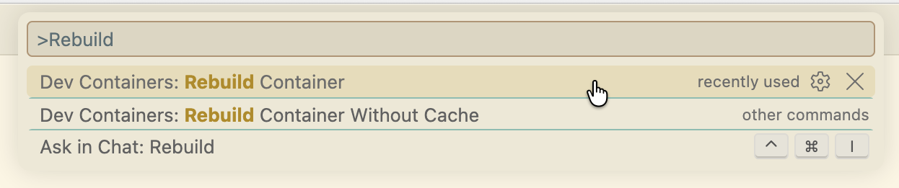
:::

## GenAI in Dev Containers

:::{ .column width="45%" .x-large-text .fragment}
##### Rootless containers can act as a sandbox to prevent agents from accessing files in other projects.

This session had the multiOmicDataSet repo attached the workspace.

Copilot was unable to write to a file in another repo.

If it went rogue and tried to anyway, it would be _incapable_ of doing so.
:::

:::{.column width="3%"}
:::

:::{.column width="52%"}
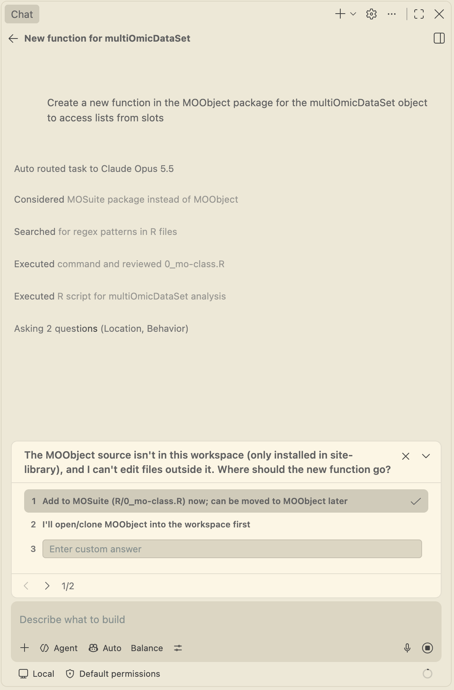
:::

## Project organization

**Option 1**: One Dev Container per repository, open a separate VS Code window for each repo you're working on.

:::{.column width="45%"}
```{.md filename="VS Code window 1"}
~/CCBR/mosuite
├── .devcontainer/
│   ├── devcontainer-lock.json
│   └── devcontainer.json
├── DESCRIPTION
├── docker/
│   ├── Dockerfile
│   └── Dockerfile-dev
├── R/
└── ...
```
:::

:::{.column width="5%"}
:::

:::{.column width="45%"}
```{.md filename="VS Code window 2"}
~/CCBR/Tools
├── .devcontainer/
│   ├── devcontainer-lock.json
│   └── devcontainer.json
├── docker/
│   ├── Dockerfile
│   └── Dockerfile-dev
├── pyproject.toml
├── src/
└── ...
```
:::

::::{.callout-tip .fragment}
This works best when the projects are mostly unrelated and not interdependent.
::::

::: {.notes}

Separate "what users need" from "what developers need." The Dev Container is for contributors; have a separate container for users (if you choose to make one available).
:::

## Project organization

**Option 2**: Create a workspace with repos in subdirectories. Only need to open one VS Code window for the workspace.

:::{.column width="45%"}
```{.md filename="VS Code workspace"}
~/projects/NIDAP
├── .devcontainer/
│   ├── devcontainer-lock.json
│   └── devcontainer.json
├── Code-Ocean.code-workspace
├── Code-Ocean-Capsule-Template/
├── demo-syncweaver-host-capsule/
├── demo-syncweaver-source-monorepo/
├── MOSuite-batch-correct-counts/
├── MOSuite-clean/
├── MOSuite-create/
├── MOSuite-diff-counts/
├── MOSuite-filter-counts/
├── MOSuite-filter-diff/
├── MOSuite-normalize-counts/
├── OMIX/
└── ...
```
:::

:::{.column width="5%"}
:::

:::{.column width="40%"}
::::{.callout-tip .fragment}
This option works best for projects with multiple related and interconnected repositories.
If you often need to edit code across multiple repos for a given task, set up a workspace with all of those repos.
::::

::::{.callout-tip .fragment}
These 2 options are not mutually-exclusive. You can mix-and-match as you see fit!
::::
:::

:::{.notes}
For option 2 (multiple repos in subdirectories), the subdirs must form a **clade**, aka a **monophyletic group**.

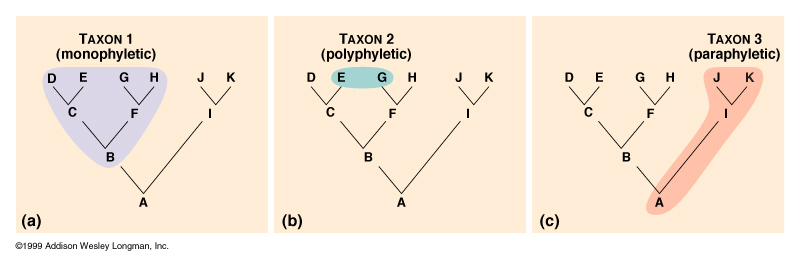

Image source: [OpenStax. (n.d.). 23.2: Determining evolutionary relationships. Biology LibreTexts.](https://bio.libretexts.org/Bookshelves/Introductory_and_General_Biology/Principles_of_Biology/03%3A_Chapter_3/23%3A_Evolutionary_Relationships/23.02%3A_Determining_Evolutionary_Relationships)
:::

## How to find examples of Dev Containers

Look for samples and template Dev Containers from established projects for inspiration.

- Official registry of Dev Container templates: <https://containers.dev/templates>
- rocker (R containers): <https://rocker-project.org/images/devcontainer/templates.html>
- VS Code sample Dev Containers

## Sample Dev Containers

:::{.large-text}
Open the command palette () and search for "sample".
:::

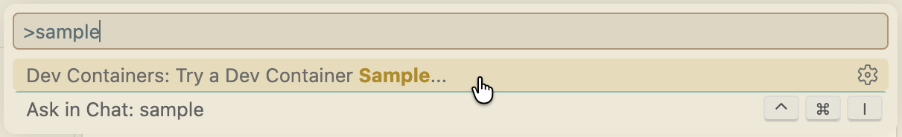{width="65%"}
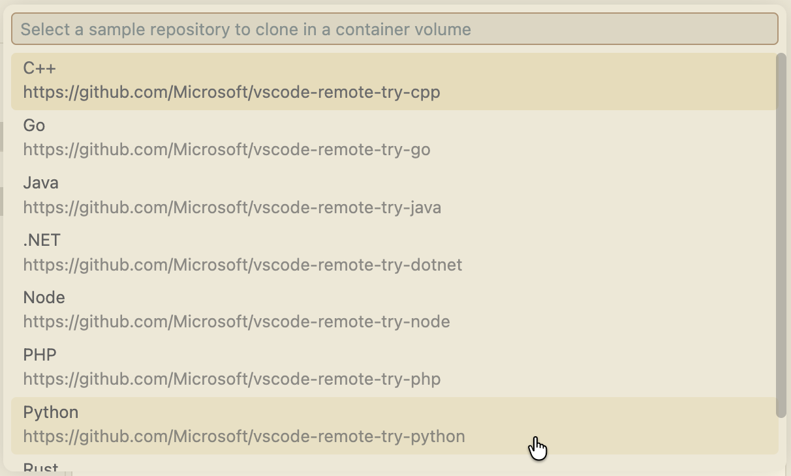{width="65%"}


::: footer
<https://code.visualstudio.com/docs/devcontainers/tutorial#_get-the-sample>
:::

## Sample Dev Container: Python

:::{.align-center}
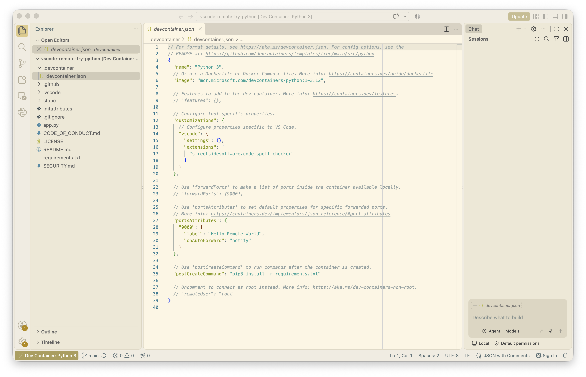
:::

## Dev Container Features

> Development container "Features" are self-contained, shareable units of
> installation code and Dev Container configuration. The name comes from the idea
> that referencing one of them allows you to quickly and easily add more tooling,
> runtime, or library "Features" into your development container for use by you or
> your collaborators.
>
> _-- [VS Code docs: Dev Container Features](https://code.visualstudio.com/docs/devcontainers/containers#_dev-container-features)_

Registry of Features: <https://containers.dev/features>

## Dev Container Features

```{.json filename="devcontainer.json"}
{
	"name": "Data Science (Python and R)",
	"image": "mcr.microsoft.com/devcontainers/base:ubuntu",
	// Features to add to the Dev Container. More info: https://containers.dev/features.
	"features": {
		"ghcr.io/devcontainers/features/python:1": {
			"version": "latest"
		},
		"ghcr.io/rocker-org/devcontainer-features/r-apt:latest": {
			"vscodeRSupport": "full",
			"installDevTools": true,
			"installRadian": true,
			"installRMarkdown": true,
			"installVscDebugger": true
		},
		"ghcr.io/rocker-org/devcontainer-features/apt-packages:1": {
			"packages": "r-cran-data.table,r-cran-tidyverse",
			"upgradePackages": true
		}
	},
	"overrideFeatureInstallOrder": [
		"ghcr.io/rocker-org/devcontainer-features/r-apt"
	],
	// Use 'postCreateCommand' to run commands after the container is created.
	"postCreateCommand": "pip install ipykernel ipywidgets && if [ -f requirements.txt* ]; then pip install -r requirements.txt; else pip install pandas numpy matplotlib seaborn scikit-learn; fi",
	// Use 'forwardPorts' to make a list of ports inside the container available locally.
	// "forwardPorts": [],
	// Configure tool-specific properties.
	"customizations": {
		// Configure properties specific to VS Code.
		"vscode": {
			// Set *default* container specific settings.json values on container create.
			"settings": {
				"[python]": {
					"defaultInterpreterPath": "/opt/conda/bin/python",
					"editor.defaultFormatter": "ms-python.black-formatter",
					"editor.formatOnType": true,
					"editor.formatOnSave": true
				},
				"[jupyter]": {
					"themeMatplotlibPlots": true,
					"widgetScriptSources": [
						"unpkg.com",
						"jsdelivr.com"
					]
				},
				"[r]": {
					"rterm.linux": "/usr/local/bin/radian",
					"r.bracketedPaste": true
				}
			},
			// Add the IDs of extensions you want installed when the container is created.
			"extensions": [
				"ms-toolsai.jupyter",
				"ms-python.python",
				"reditorsupport.r"
			]
		}
	},
	// Set `remoteUser` to `root` to connect as root instead. More info: https://aka.ms/vscode-remote/containers/non-root.
	"remoteUser": "vscode"
}
```

When you start using Features, a `devcontainers-lock.json` will be created alongside the config file to pin the exact Feature versions.

::: footer
<https://github.com/microsoft/datascience-py-r/blob/main/src/datascience-py-r/.devcontainer/devcontainer.json>
:::

## Using Git in a Dev Container

Most git commands will work, but credentials must be shared with the container in order to do `git fetch/push/pull`.

:::{.column}
```{.sh filename="Terminal"}
$ git push

git@github.com: Permission denied (publickey).
fatal: Could not read from remote repository.

Please make sure you have the correct access rights
and the repository exists.
```
:::

:::{.callout-important .fragment}
- If you're using **fine-grained PATs** with the macOS keychain, it'll probably work for you by default. ✅
- If you're using **SSH keys**, I haven't figured out how to get SSH forwarding to work yet. 🚧
:::

<!--
## Using Git in a Dev Container

Allow SSH Keys to be forwarded to the container.

- Search for `AllowAgentForwarding` in `/etc/ssh/sshd_config`.
- Ensure it is uncommented and set to "yes".
- You will need sudo privileges to save the file.

:::{.column}
```{.text filename="/etc/ssh/sshd_config"}
AllowAgentForwarding yes
```
:::

::: footer
<https://code.visualstudio.com/remote/advancedcontainers/sharing-git-credentials>
:::
-->

## Troubleshooting

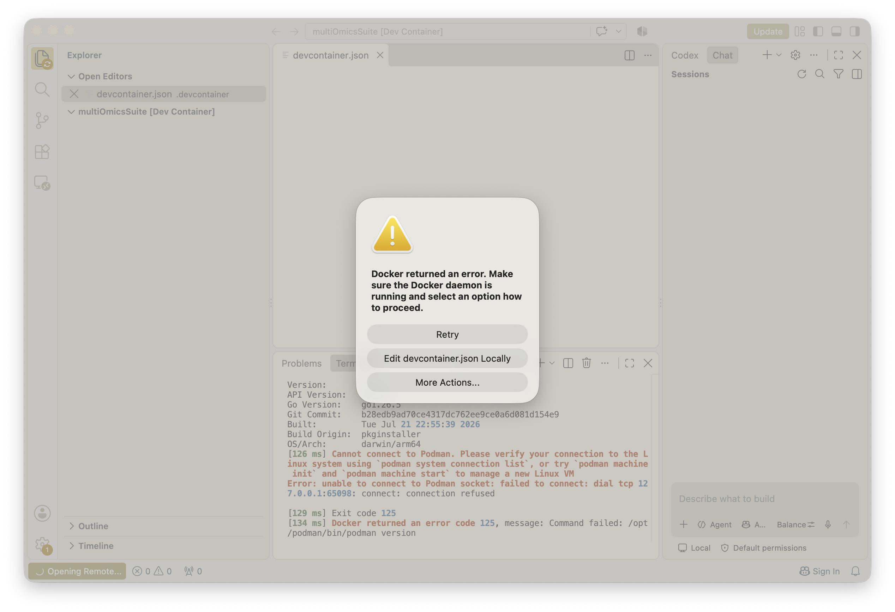

::: footer
When opening the Dev Container fails instantly, make sure you started the podman machine.
:::

:::{.notes}
This happens most often when I restart my computer and forget to start podman before developing.
Key part of the error message:

> Make sure the docker daemon is running
:::

## Troubleshooting

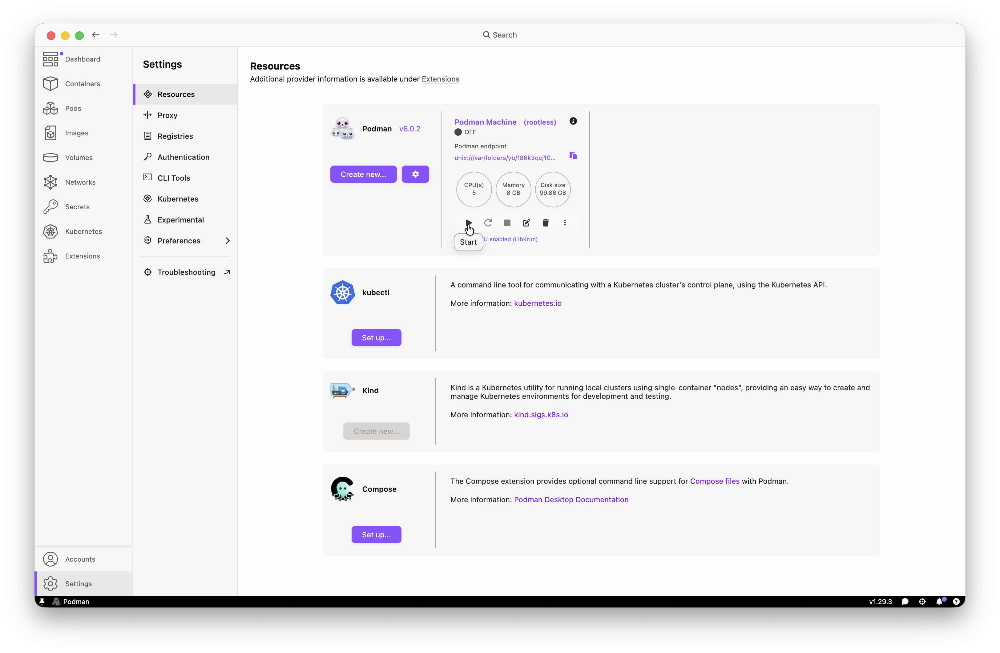

::: footer
When opening the Dev Container fails instantly, make sure you started the podman machine.
:::

:::{.notes}
This happens most often when I restart my computer and forget to start podman before developing.
:::

## Troubleshooting: insufficient resources

:::{.column width="80%"}

::::{.x-large-text}
If processes in the Dev Container fail due to insufficient resources (memory, disk space),
increase the resources for the default podman machine and restart it.

- disk size in GB
- memory in MB
::::

```{.sh filename="Terminal"}
podman machine stop
podman machine set --cpus 4 --disk-size 112 --memory 12288 --rootful=false
podman machine start
```
:::

## Troubleshooting: when the build fails

:::{.align-center}

:::

::: footer
When the container fails to be built, copy the log from the terminal.
:::

## Troubleshooting: use agents for help

:::{.align-center}

:::

:::{.x-large-text}
- Copy relevant parts of the log from the terminal and paste it into a _separate_ window's Copilot session.
- Do not use the same VS Code window; you're going to want to reload the window when trying to build the container again.
:::

## Troubleshooting: evaluate the response

::::{.column width="50%"}

::::

::::{.column width="1%"}
::::

::::{.column width="48%" .x-large-text}
Diagnosis from Copilot:

> Podman's --cache-from only accepts a repository name, while Docker also accepts a tagged image
::::

<!--
## Troubleshooting: validate the response

Let's validate the response from Copilot before we rebuild the container.

> Podman's --cache-from only accepts a repository name, while Docker also accepts a tagged image

## Troubleshooting: use a search engine

Let's validate the response from Copilot before we rebuild the container.

:::{.align-center}

:::

::: footer
Open your preferred search engine.
p.s. I like brave because you can turn off AI overview results.
:::

## Troubleshooting: likely hits

::: {.align-center}
{width="70%"}
:::

::: footer
Peruse the results, looking for GitHub issues, StackOverflow answers, and other forums.
:::

## Troubleshooting: found an open issue

:::{.align-center}
{width="90%"}
:::

::: footer
✅ Confirmed, this is likely the cause: this issue is relevant & still open.
:::

## Troubleshooting: rebuild

Fix the devcontainer config file, then try rebuilding the container

:::{.column width="47%"}
```{.json filename="devcontainer.json BUGGY"}
{
  "build": {
    "dockerfile": "../docker/Dockerfile-dev",
    "context": "..",
    "cacheFrom": "nciccbr/mosuite-dev:v0.5.0.9000"
  }
}
```
:::

:::{.column width="5%" .align-center}
➡️
:::

:::{.column width="47%"}
```{.json filename="devcontainer.json FIXED"}
{
  "build": {
    "dockerfile": "../docker/Dockerfile-dev",
    "context": "..",
    "cacheFrom": "nciccbr/mosuite-dev"
  }
}
```
:::

**It worked!**
-->

## Dev Containers in VS Code on macOS

So far I've shown you how to get started using Dev Containers in VS Code on macOS.

- But what about other IDEs? RStudio, Positron
- Other environments? Biowulf, FRCE

## Positron

Positron supports Dev Containers!

:::{.align-center}

:::

...but I haven't gotten it to work 😿

::: footer
Instructions in positron's documentation to enable development containers:
<https://positron.posit.co/dev-containers.html>
:::

:::{.notes}
I like VS Code for most things, but prefer Positron for R. If anyone can get this working in Positron, please let me know!
:::

## Biowulf

- [You can open Dev Containers on a remote host over ssh.](https://code.visualstudio.com/docs/devcontainers/containers#_open-a-folder-on-a-remote-ssh-host-in-a-container)
- But the Dev Container extension does not yet support singularity (see [microsoft/vscode-remote-release#3066](https://github.com/microsoft/vscode-remote-release/issues/3066)).
- This will probably work if the HPC staff make podman available on biowulf in the future.

## Conclusion {.x-large-text}

#### Dev Containers have a lot of potential

- Dev Containers can help developers make their dependency management more precise and streamlined, especially when collaborating with others.
  - There is an overhead to setting up containers, but using them is fairly smooth once built.
- Security benefit: rootless containers can act as a sandbox for genAI agents to prevent them from reading/writing files in other projects.

:::{.fragment}
#### Limitations prevent us from getting the most out of them right now

- Difficulties with git authentication via SSH.
- Lack of support/compatibility on Biowulf.
- Difficulties with Positron.
- GenAI is not as helpful at troubleshooting Dev Containers. Lots of red herrings.

**_But these could change in the future!_**
:::

## Resources

- [Dev Containers extension for VS Code](https://code.visualstudio.com/docs/devcontainers/containers)
  - [Tutorial](https://code.visualstudio.com/docs/devcontainers/tutorial)
  - [Tips & Tricks](https://code.visualstudio.com/docs/devcontainers/tips-and-tricks)
- [The rocker project - containers for R](https://rocker-project.org/use/editor.html#visual-studio-code-dev-containers)
- [Development containers specification](https://containers.dev/)
