## Agenda

TODO

## Installers & dependency managers

|                         | language | environments |
|-------------------------|----------|--------------|
| pip                     | python   | ❌ |
| uv, venv, pyenv         | python   | ✅ |
| `install.packages`, pak | R        | ❌ |
| renv                    | R        | ✅ |
| conda, mamba            | polyglot | ✅ |
| pixi                    | polyglot | ✅ |

## Separate environments per project for reproducibility

::: {.column}
```md
projects
├── CCBR-abc
├── CCBR-xyz
├── cool-python-package
└── RStatsPackage
```
:::

## Separate environments per project for reproducibility


::: {.column}
```md
projects
├── CCBR-abc
│   └── environment.yml
├── CCBR-xyz
│   ├── data-integration
│   │   └── env.yml
│   └── figures
│       └── env.yml
├── cool-python-package
│   └── pyproject.toml
└── RStatsPackage
    └── renv.lock
```
:::

::: {.column .fragment}
- Each project specifies its own package versions.
- Can use different environment managers for different projects.
- Keep configuration in git so it is version controlled & shared with others.
:::

## Containers handle dependencies at the OS level

::: {.column width="45%"}
#### Package managers

Install dependency versions on your local machine.

There can be slight differences in compiled versions of software depending on the hardware and operating system.
:::

::: {.column width="5%"}
:::

::: {.column width="45%"}
#### Containers

Container images ship with exact versions of dependencies already compiled and installed for a specific OS.
:::

TODO show how we're using containers in smk & nxf pipelines, also mosuite code ocean capsules

## Containers as development environments

[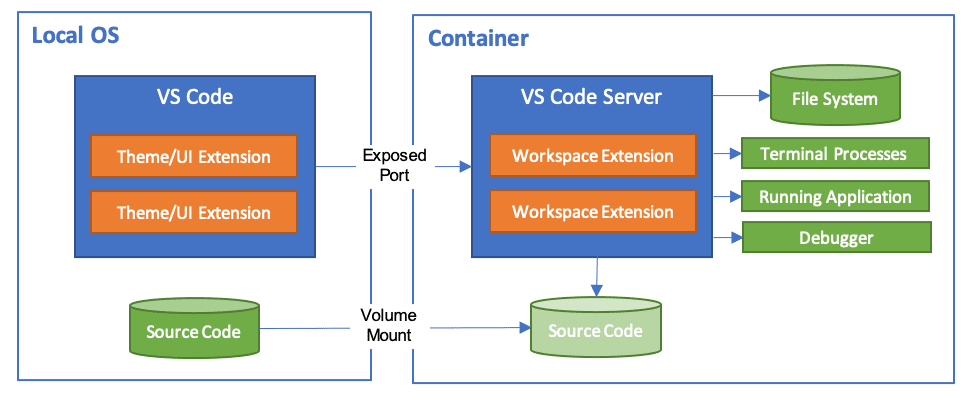](https://code.visualstudio.com/docs/devcontainers/containers#_quick-start-open-an-existing-folder-in-a-container)

## Why use dev containers?

- Dependency management for developers, including IDE extensions
- Consistent dependency versions across collaborators
- Keep genAI tools in a sandbox for security

:::{.fragment}
### Why _not_?

- Heavier disk usage
- Building takes time
- Not user-friendly
- Not intended for _users_, only _contributors_.
  - Still need to have adequate documentation of dependencies for users.
:::

::: {.notes}
- e.g. conda envs can share package versions across environments, containers can't
:::

## Container engines

|           | Biowulf HPC | GFE macOS |                               |
|-----------|---|---|-------------------------------|
| 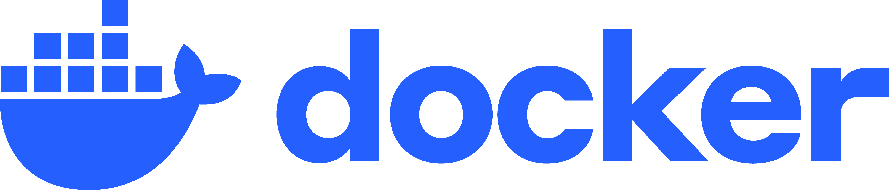 | ❌          |  ❌        | Industry standard, but incompatible with HPC due to root privileges. CBIIT won't allow Docker on macOS due to security concerns.   |
|  {width="50px"} | ✅          |  ❌        | Great for HPC, doesn't support macOS. CLI not exactly identical to docker, but generally compatible.       |
| 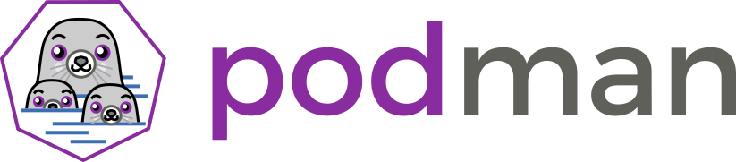 | ❌          | ✅         | Could be installed on Biowulf in the future. CLI is a drop-in replacement for docker. Rootless by default. |

:::{.notes}
- Docker runs containers with root privileges. Podman, singularity, and apptainer don't have this glaring security risk.
- Singularity history: Singularity was renamed to Apptainer and maintained by the Linux Foundation, then there was a fork of Apptainer to create SingularityCE by Sylabs.
:::

## Podman

:::{.align-center}

:::

## Podman

:::{.align-center}
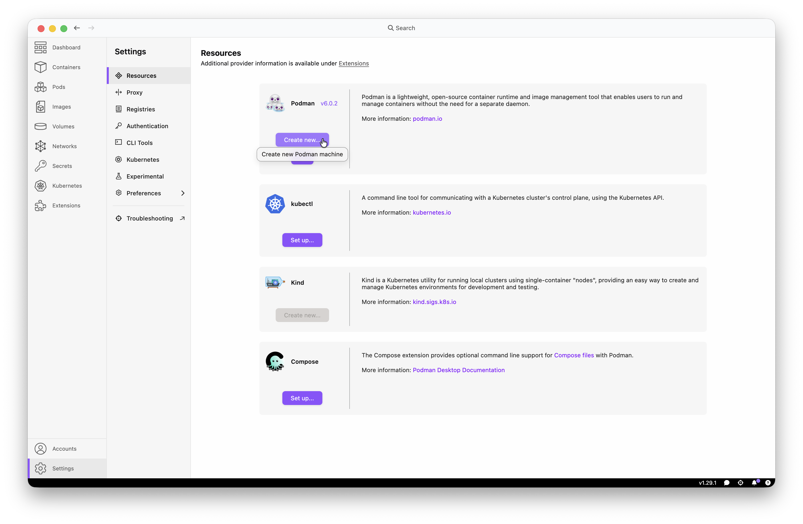
:::

## Podman

:::{.align-center}
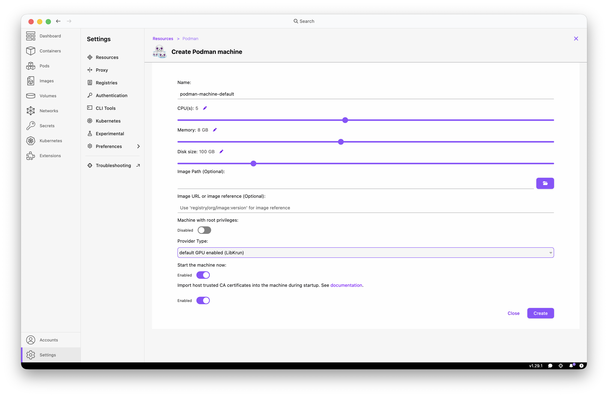
:::

## Podman

:::{.align-center}
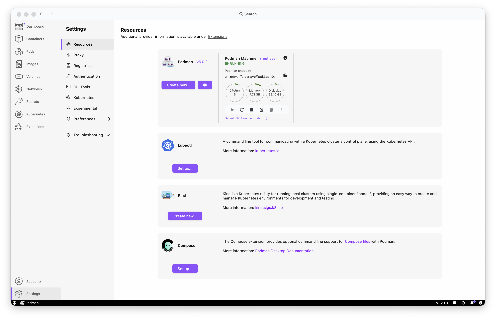
:::

## Podman

:::{.align-center}
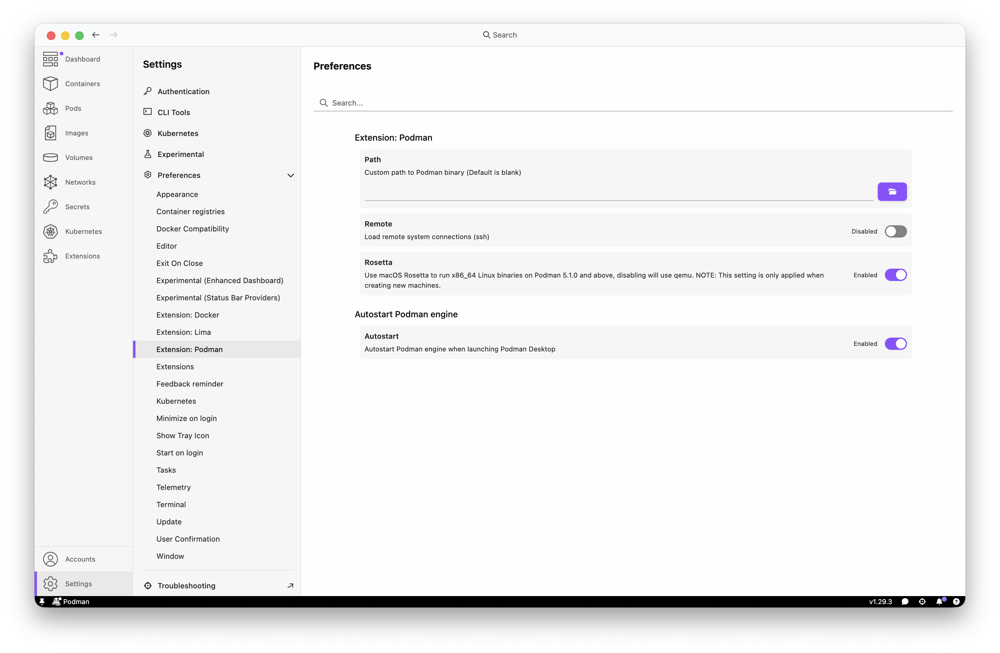
:::

## Podman

:::{.align-center}
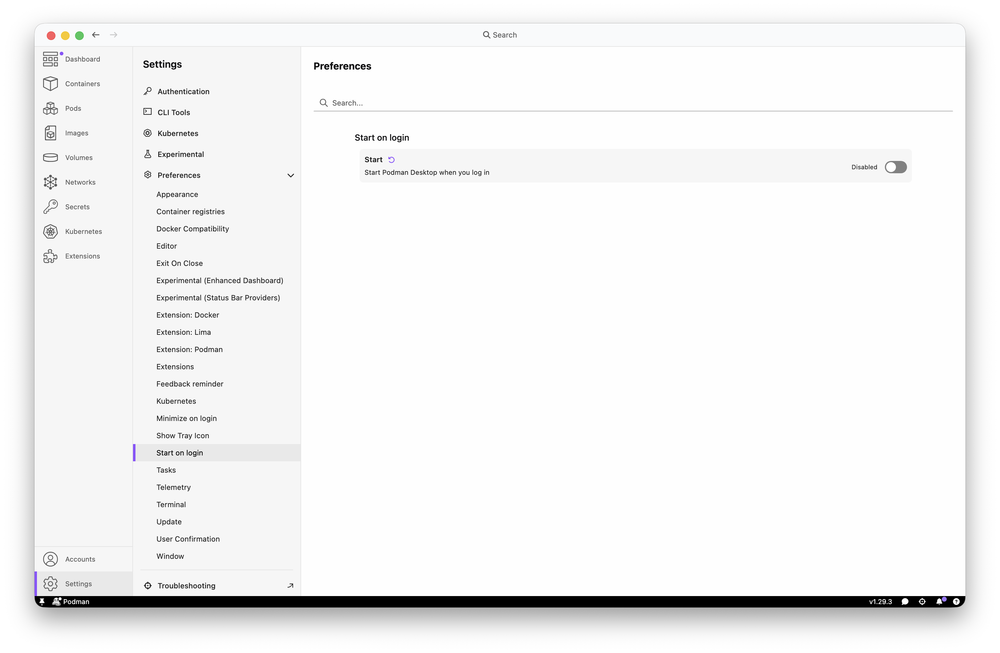
:::

::: footer
Consider toggling on if you use podman daily, or toggle it off if you use it sparingly.
:::

## VS Code

Install Dev Containers extension

TODO use full path to podman `/opt/podman/bin/podman`

:::{.align-center}
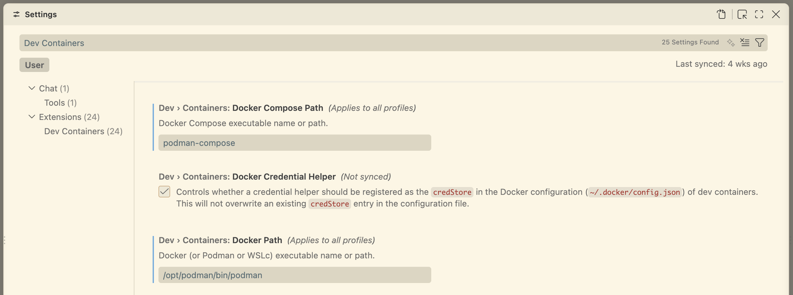
:::

::: !Tip
disconnect from your vpn -- it interferes with pulling the container
:::

## Open the project in a new VS Code window

TODO screenshot

#### Create a basic dev container configuration file

```{.json filename="devcontainer.json"}
{
    "image": "nciccbr/mosuite-dev:v0.5.0.9000"
}
```

## Start the dev container {.x-large-text}

- Open the VS Code command palette: 
- Select `Dev Containers: Reopen in Container`

:::{.align-center}
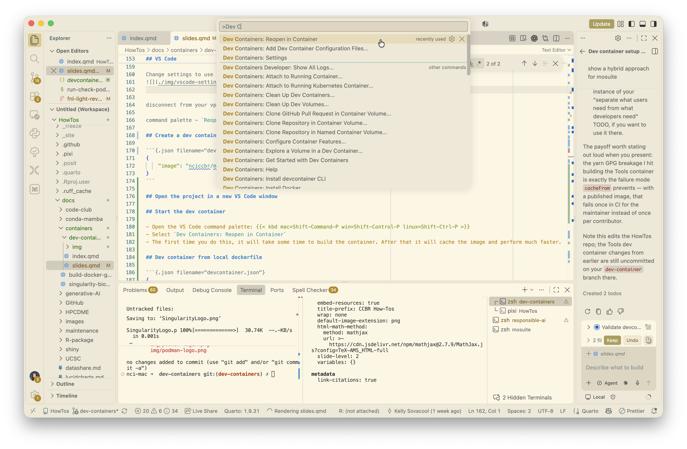{width="100%"}
:::

## Start the dev container {.x-large-text}

:::{.align-center}

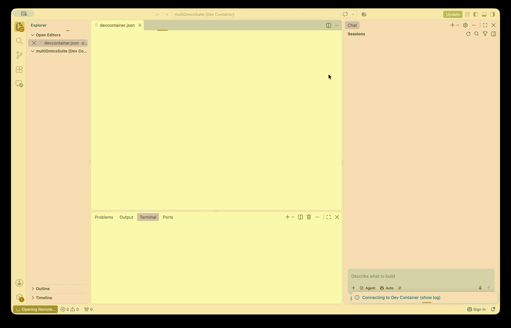{width="80%"}
:::

## Start the dev container {.x-large-text}

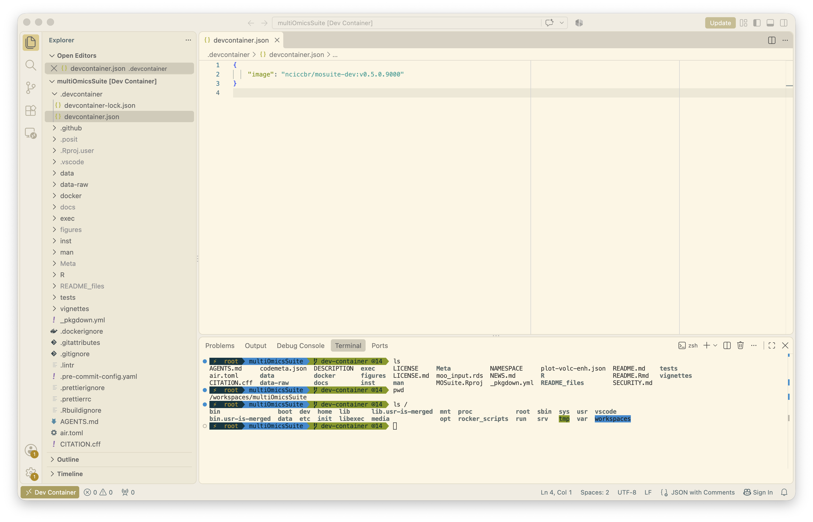

- You'll have all of the dependencies installed in the container available to use during development and testing.
- Podman mounts the project directory to the container, and those are the only files that can be edited in the VS Code session.

## Dev container from local dockerfile

```{.json filename="devcontainer.json"}
{
  "build": {
    "dockerfile": "../docker/Dockerfile-dev",
    "context": "..",
    "cacheFrom": "nciccbr/mosuite-dev:v0.5.0.9000"
  }
}
```

## Rebuild the dev container when the config file changes

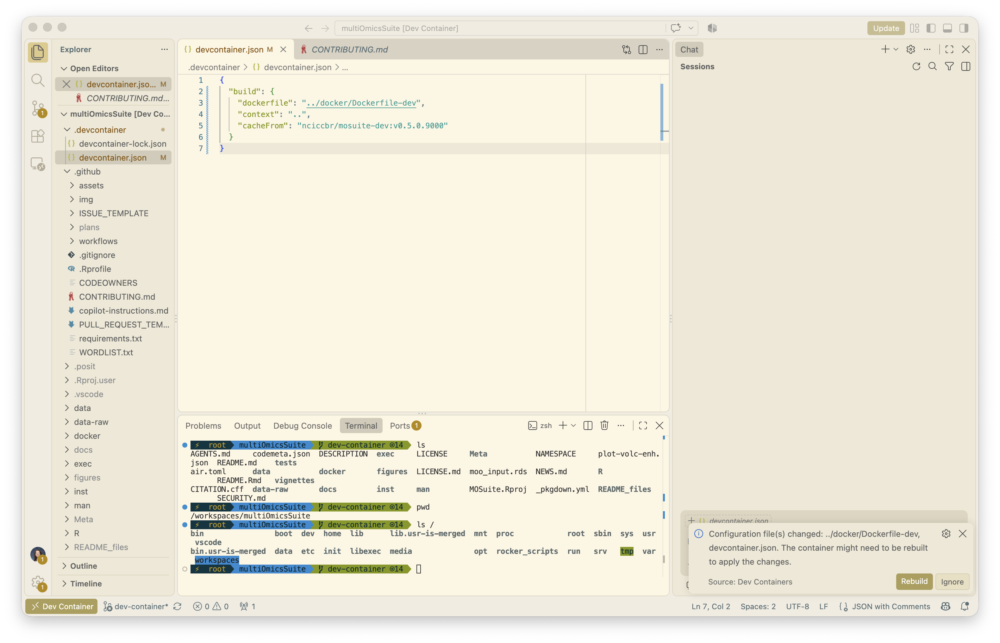

## GenAI in dev containers

Keep genAI tools in a sandbox for security

Rootless containers can act as a sandbox for genAI agents to prevent them from reading/writing files in other projects.

TODO is this true? note: chat sessions do not persist. Need to use a handoff file if chat sessions span multiple workdays / vs code sessions.

## Project organization

**Option 1**: One dev container per repository, open a separate VS Code window for each repo you're working on.

:::{.column width="45%"}
```{.md filename="VS Code window 1"}
~/CCBR/mosuite
├── .devcontainer/
│   ├── devcontainer-lock.json
│   └── devcontainer.json
├── DESCRIPTION
├── docker/
│   ├── Dockerfile
│   └── Dockerfile-dev
├── R/
└── ...
```
:::

:::{.column width="5%"}
:::

:::{.column width="45%"}
```{.md filename="VS Code window 2"}
~/CCBR/Tools
├── .devcontainer/
│   ├── devcontainer-lock.json
│   └── devcontainer.json
├── docker/
│   ├── Dockerfile
│   └── Dockerfile-dev
├── pyproject.toml
├── src/
└── ...
```
:::

## Project organization

**Option 2**: Create a workspace with repos in subdirectories. Only need to open one VS Code window for the workspace.

:::{.column width="48%"}
```{.md filename="VS Code workspace"}
~/projects/NIDAP
├── Code-Ocean.code-workspace
├── devcontainer.json
├── Code-Ocean-Capsule-Template/
├── demo-syncweaver-host-capsule/
├── demo-syncweaver-source-monorepo/
├── MOSuite-batch-correct-counts/
├── MOSuite-clean/
├── MOSuite-create/
├── MOSuite-diff-counts/
├── MOSuite-filter-counts/
├── MOSuite-filter-diff/
├── MOSuite-normalize-counts/
├── OMIX/
└── ...
```
:::

## Choosing a base image for the dev container

TODO


## Dev container features

> Development container "Features" are self-contained, shareable units of
> installation code and dev container configuration. The name comes from the idea
> that referencing one of them allows you to quickly and easily add more tooling,
> runtime, or library "Features" into your development container for use by you or
> your collaborators.

[VS Code docs - dev container features](https://code.visualstudio.com/docs/devcontainers/containers#_dev-container-features)

## Dev container features

TODO show examples of more involved dev container configs

TODO Separate "what users need" from "what developers need." The dev container is for contributors; have a separate container for users (if you choose to make one available).

## Container remote user

TODO

## Using Git in a Dev Container

TODO

::: footer
<https://code.visualstudio.com/remote/advancedcontainers/sharing-git-credentials>
:::

## Troubleshooting: when the build fails

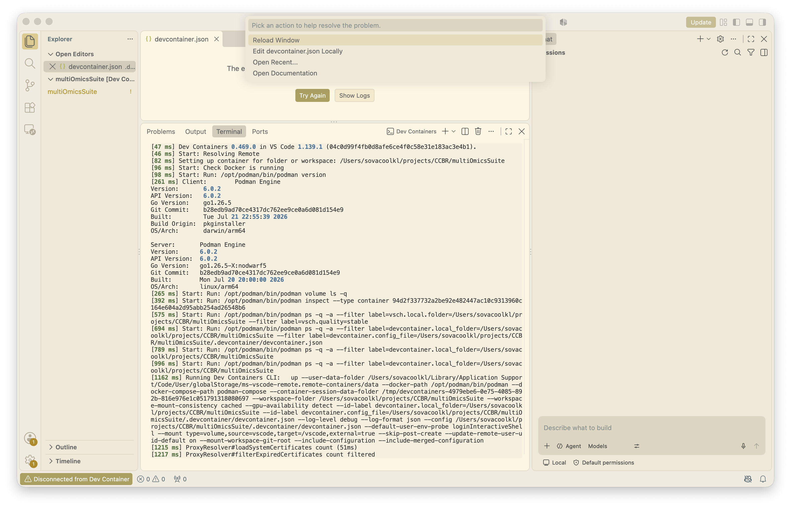

## Troubleshooting: use agents for help

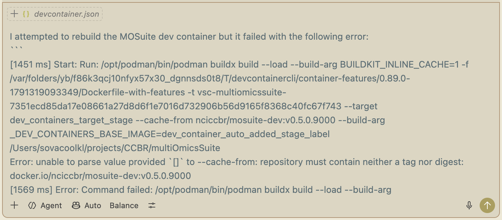

## Troubleshooting: evaluate the response

::::{.column width="50%"}
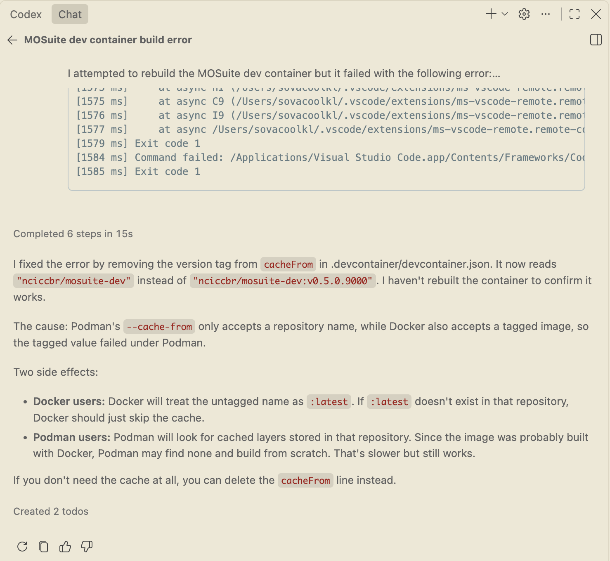
::::

::::{.column width="1%"}
::::

::::{.column width="48%" .x-large-text}
Key diagnosis from Copilot:

> Podman's --cache-from only accepts a repository name, while Docker also accepts a tagged image

:::{.fragment}
Let's validate the response from Copilot before we rebuild the container.
:::
::::

## Troubleshooting: validate the response

Validate the response from Copilot

> Podman's --cache-from only accepts a repository name, while Docker also accepts a tagged image

## Troubleshooting: use a search engine

Validate the response from Copilot

:::{.align-center}
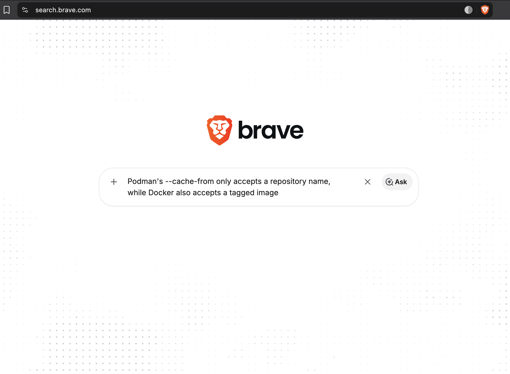
:::

::: footer
p.s. I like brave because you can turn off AI overview results.
:::

## Troubleshooting: likely hits

::: {.align-center}
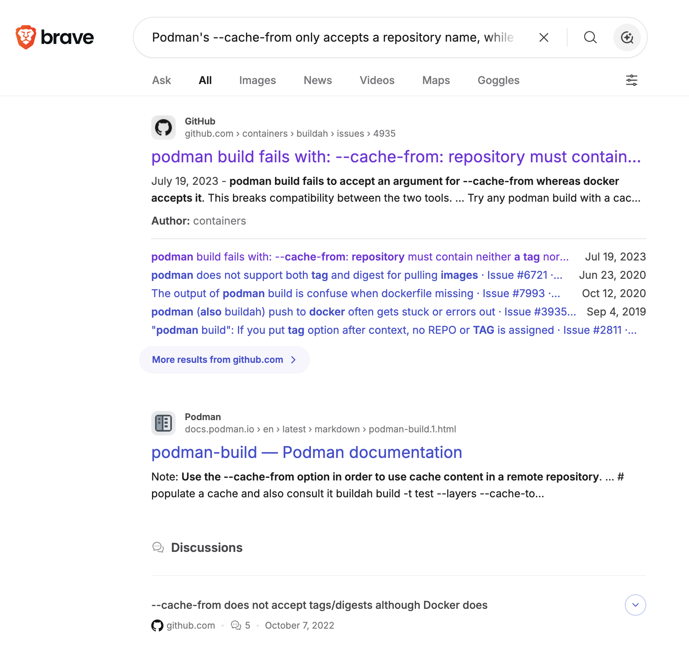{width="70%"}
:::

## Troubleshooting: found an open issue

:::{.align-center}
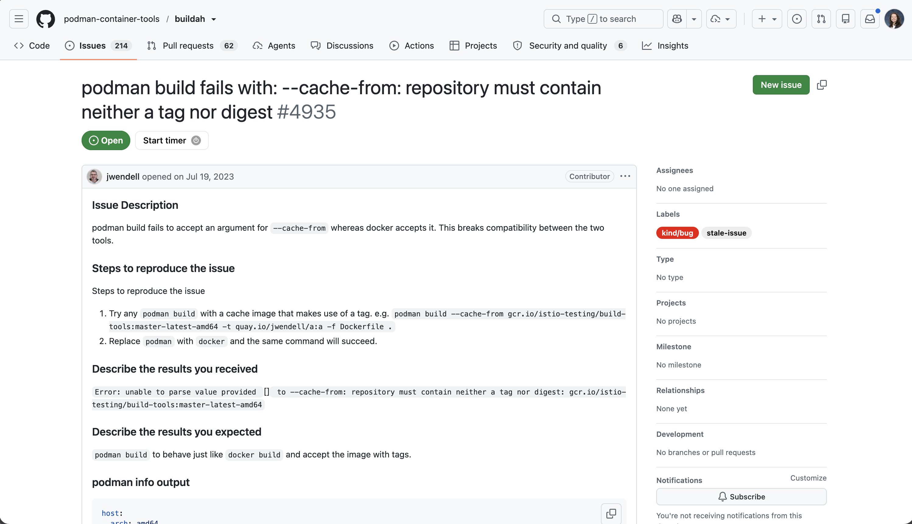{width="90%"}
:::

## Troubleshooting: rebuild

Try rebuilding the container

## Positron

Positron supports dev containers!

...but I haven't gotten it to work...

I like VS Code for most things, but prefer Positron for R. If anyone can get this working in Positron, please let me know!

Instructions in positron's documentation to enable development containers:
<https://positron.posit.co/dev-containers.html>

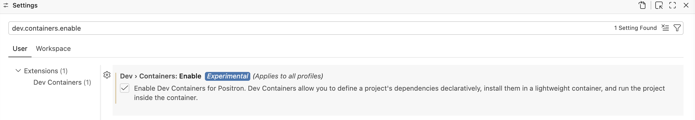

## Biowulf

- [You can open dev containers on a remote host over ssh.](https://code.visualstudio.com/docs/devcontainers/containers#_open-a-folder-on-a-remote-ssh-host-in-a-container)
- But the dev container extension does not yet support singularity (see [microsoft/vscode-remote-release#3066](https://github.com/microsoft/vscode-remote-release/issues/3066)).
- This will probably work if the HPC staff make podman available on biowulf in the future.

## Conclusion

- dev containers can help developers make their dependency management more precise and streamlined, especially when collaborating with others.
  - There is an overhead to setting up containers, but using them is fairly smooth once built.
- Security benefit: rootless containers can act as a sandbox for genAI agents to prevent them from reading/writing files in other projects.
- Limitations prevent us from getting the most out of dev containers right now.
  - Lack of support/compatibility on Biowulf.
  - Difficulties with Positron.
  - But this could change in the future!

## Resources

- [Dev Containers extension for VS Code](https://code.visualstudio.com/docs/devcontainers/containers)
  - [Tutorial](https://code.visualstudio.com/docs/devcontainers/tutorial)
  - [Tips & Tricks](https://code.visualstudio.com/docs/devcontainers/tips-and-tricks)
- [The rocker project - containers for R](https://rocker-project.org/use/editor.html#visual-studio-code-dev-containers)
- [Development containers specification](https://containers.dev/)
