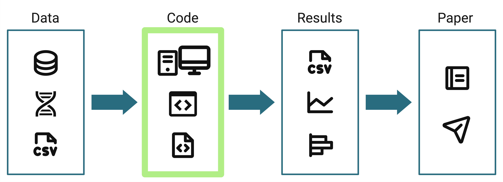
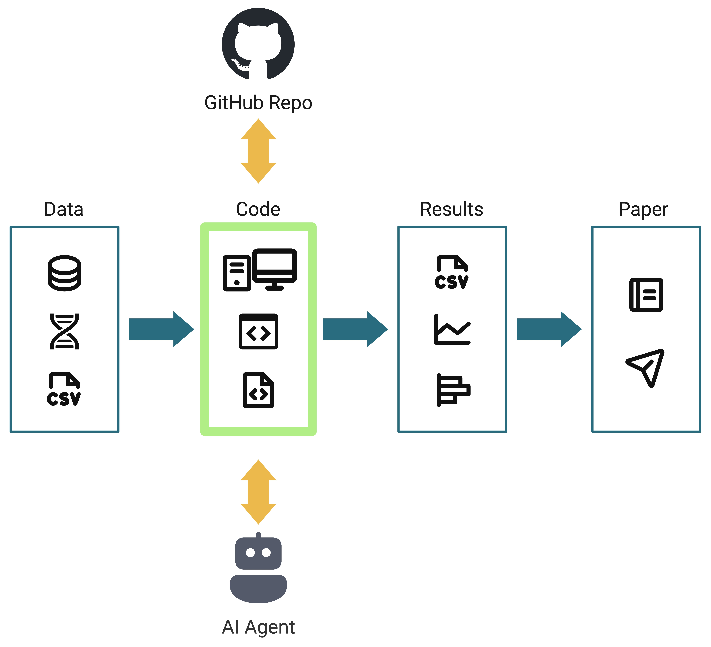

## AI Accelerates Bioinformatics

## Security in the age of AI

What do we mean by...?

- Security
- Safety
- Reproducibility

## Reproducibility

Yourself -> Future you -> Your collaborators -> Peers in your field

:::{.fragment}
**You are your own most important collaborator**
:::

## Do's and Don't's

::: {.column}

### Do

- Commit your code early and often
- Use VS Code workspaces
- Create a Copilot Instructions file

:::

:::{.column .fragment}

### Don't

- Expose PHI or PII
- Blindly accept AI-generated code
- Allow AI agents to execute destructive commands

:::

## Do: commit your code

and sync it with GitHub

- Create a GitHub repo for every project
- Commit & push your code before you even start using AI agents
- Commit & push every [meaningful](https://www.aleksandrhovhannisyan.com/blog/atomic-git-commits) change

::: {.notes}
you don't need to be an expert git user to get something out of git and GitHub
:::

## Do: use VS Code workspaces

Add related repos to a single VS Code workspace so Copilot will see the full context of your project

> Copilot agents search your entire codebase to understand how components connect and provide answers grounded in your actual code. You can use broad prompts like "where is authentication handled?" or "add tests for the list endpoint" and get accurate answers and edits based on your codebase.

::: footer
<https://code.visualstudio.com/docs/copilot/reference/workspace-context>
:::

## Do: create a Copilot Instructions file

VS Code automatically detects a `.github/copilot-instructions.md` file
and applies it to all chat requests in the workspace.

:::{.fragment}
#### Use custom instructions for:

- Coding style and naming conventions, preferred libraries/packages
- Architectural patterns to follow or avoid
- Security requirements and error handling approaches
- Documentation standards
:::

:::{.fragment}
Keep it short (< 500 lines), include examples, and explain the reasoning behind rules.
:::

::: footer
<https://code.visualstudio.com/docs/copilot/customization/custom-instructions>
:::

:::{.notes}
> VS Code automatically detects a `.github/copilot-instructions.md` Markdown file in the root of your workspace and applies the instructions in this file to all chat requests within this workspace.
:::

## Don't: expose PHI or PII

- GitHub Copilot is not approved to handle PHI or PII
- Do not track sensitive data files with git (use `.gitignore` file)

::: footer
<https://nih.sharepoint.com/sites/NIH-ai/SitePages/Responsible-AI.aspx>
:::

## Don't: blindly accept AI-generated code

### NIH AI Guidance

> Do not rely on the technology to be a software developer by proxy: All well-written code must adhere to security design and ethical principles. All code output needs to be reviewed for completeness, quality, efficiency, and, most of all, security. Leverage manual and automated validation tools and testing technologies to help ensure these factors. If you cannot identify or understand what a piece of AI generated code does, you should not use it.

_AI outputs may be incomplete, inaccurate, biased, or fabricated._

::: footer
<https://nih.sharepoint.com/sites/NIH-ai/SitePages/Responsible-AI.aspx>
:::

## Don't: allow agents to execute destructive commands

- Never allow agents to edit data files or output files. _You shouldn't edit these files yourself anyway._
- Do not allow agents to execute destructive commands without explicit user permission.
  
  > `rm rmdir sudo chmod chown`

::: {.notes}
> GitHub Copilot Agent Mode in VS Code requires manual confirmation for destructive commands by default to prevent accidental or malicious execution.
:::

## Do's and Don't's for AI Use

::: {.column}
### Do

- Commit your code early and often
- Use VS Code workspaces
- Create a Copilot Instructions file

:::

:::{.column}
### Don't

- Expose PHI or PII
- Blindly accept AI-generated code
- Allow AI agents to execute destructive commands

:::

:::{.align-center}
{width="60%"}
:::

## Reproducible practices for responsible AI use

:::{.align-center}
{width="60%"}
:::

## Final thoughts

- Generative AI tools use statistical models to produce outputs that look like a plausible response to a prompt.  🦜
  - Interpreting the meaning of AI outputs is your responsibility.
- AI tools accelerate bioinformatics. 🚀
  - Just make sure you're facing the direction you want to go!

## Resources

- NIH Guidelines for Responsible AI: <https://nih.sharepoint.com/sites/NIH-ai/SitePages/Responsible-AI.aspx>
- Tutorial: [GitHub Copilot in VS Code](https://ccbr.github.io/HowTos/docs/generative-AI/gh-pilot-vs-code/)
- [GitHub Copilot in VS Code cheat sheet](https://code.visualstudio.com/docs/copilot/reference/copilot-vscode-features)
- [Copilot Instructions file](https://code.visualstudio.com/docs/copilot/customization/custom-instructions)
- Related talk: [Organizing and documenting NGS pipelines on GitHub](https://bioinfo-abcc.ncifcrf.gov/training/event/organizing-and-documenting-ngs-pipelines-on-github-building-549-executive-board-room-nci-frederick-1204241200) | ABCS Programmer's Corner, 2024
