
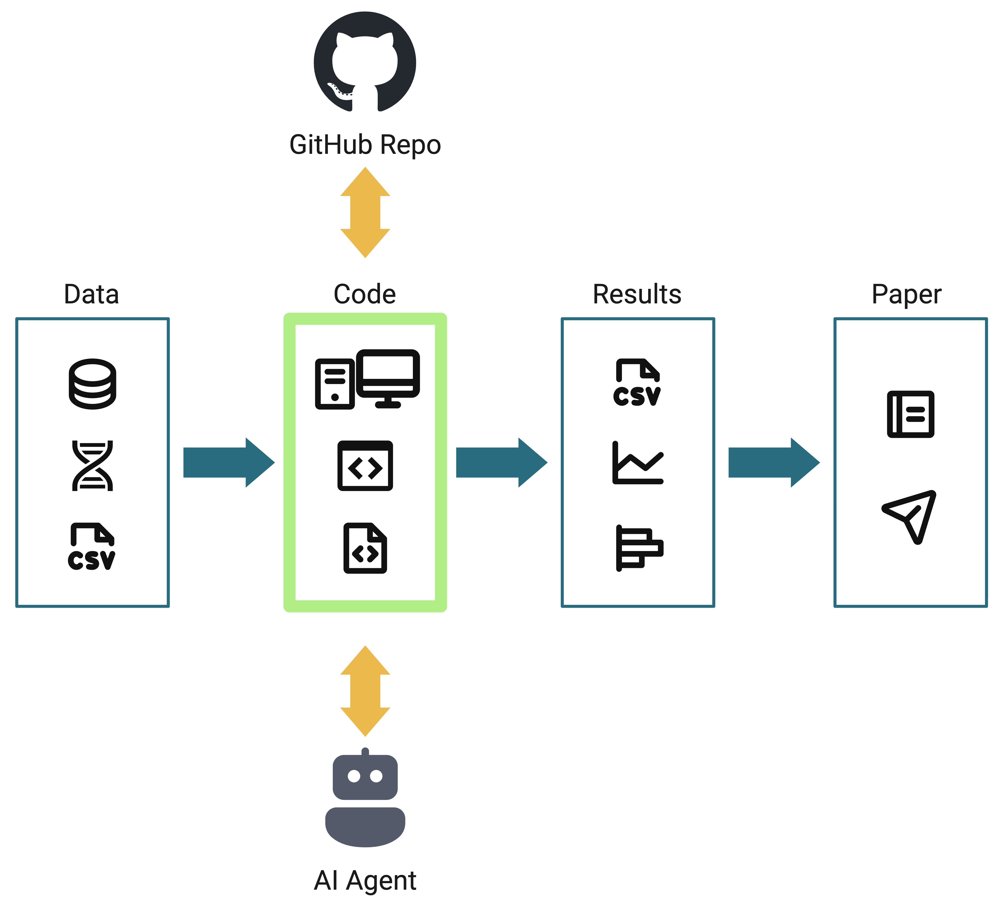

## Bioinformatics is central to biomedical research

bioinformatician / computational biologist: anyone who writes code to analyze biological data.

## Generative AI can accelerate bioinformatics

## Generative AI can accelerate bioinformatics

:::{.align-center}
{width="60%"}
:::

## Benefits and Risks of genAI use

## What is genAI _really_?

- There are a lot of claims about what genAI is and what genAI tools are capable of.
- Generative AI tools use statistical models to produce outputs that look like a plausible response to a prompt.  🦜
  - LLM as stochastic parrot. text generator. Can produce high volume of text quickly.
  - up to us to interpret the meaning. Interpreting the meaning of AI outputs is our responsibility.

## AI & ML

venn diagram: LLMs are one small part of AI overall. Agentic AI tools attach "harnesses" to LLMs that allow them to perform programmatic tasks like web search, reading & writing text files, and executing code.

## NIH AI Guidance

> Do not rely on the technology to be a software developer by proxy: All well-written code must adhere to security design and ethical principles. All code output needs to be reviewed for completeness, quality, efficiency, and, most of all, security. Leverage manual and automated validation tools and testing technologies to help ensure these factors. If you cannot identify or understand what a piece of AI generated code does, you should not use it.

_AI outputs may be incomplete, inaccurate, biased, or fabricated._

::: footer
<https://nih.sharepoint.com/sites/NIH-ai/SitePages/Responsible-AI.aspx>
:::

:::{.notes}
The NIH Responsible AI guidance is a helpful framework to start with. But the details are left to us to figure out.
:::

## Human in the loop

https://marketoonist.com/2026/03/human-in-the-loop.html

The problem with human-in-the-loop is the human is responding to the AI output,
rather than being the driving force. Humans must remain in full control.

## Human ~in~ driving the loop

## Bioinformaticians design, develop, and execute code

### How can genAI assist us in bioinformatics tasks?

## Practical tips for responsible AI use

- Have a plan for how/when you will use it, and how/when you will _not_ use it.
  - Many journals do not allow genAI to be used for writing manuscripts.
- Follow reproducible practices always, from the beginning of every project, before you even consider using AI.
  - Be organized. One directory per project. Keep data, code, and outputs in separate directories.
  - Use version control. Back up your code to GitHub.
- Use genAI to write code. Don't use genAI to analyze data or write outputs directly. Code is the record for reproducibility.
- Treat genAI like an untrustworthy stranger. Be skeptical. Do not blindly trust it. Review every response and output. Ensure you understand it. Do not use AI-generated code until you do understand it.
  - Learning opportunity.
- Document your genAI use. Be transparent about how you use it and which tools you used.

## Reproducibility is essential for science {background-gradient="radial-gradient( #A6C7C9, #FFFFFF)"}

Yourself -> Future you -> Your collaborators -> Peers in your field

:::{.fragment}
**You are your own most important collaborator**
:::

## Reproducible practices for responsible AI use

:::{.align-center}
{width="60%"}
:::

## Final reminders

- Generative AI tools use statistical models to produce outputs that look like a plausible response to a prompt.  🦜
  - Interpreting the meaning of AI outputs is your responsibility.
- AI tools can accelerate bioinformatics. 🚀
  - Just make sure you're facing the direction you want to go!

## Resources

- [NIH Guidelines for Responsible AI](https://nih.sharepoint.com/sites/NIH-ai/SitePages/Responsible-AI.aspx)
- Tutorial: [GitHub Copilot in VS Code](https://ccbr.github.io/HowTos/docs/generative-AI/gh-pilot-vs-code/)
- [GitHub Copilot in VS Code cheat sheet](https://code.visualstudio.com/docs/copilot/reference/copilot-vscode-features)
- [Copilot Instructions file](https://code.visualstudio.com/docs/copilot/customization/custom-instructions)
- Related talk: [Organizing and documenting NGS pipelines on GitHub](https://bioinfo-abcc.ncifcrf.gov/training/event/organizing-and-documenting-ngs-pipelines-on-github-building-549-executive-board-room-nci-frederick-1204241200) | ABCS Programmer's Corner, 2024
