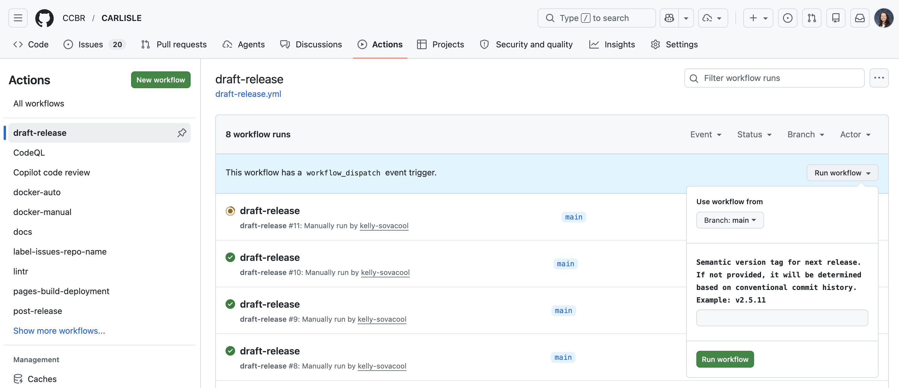
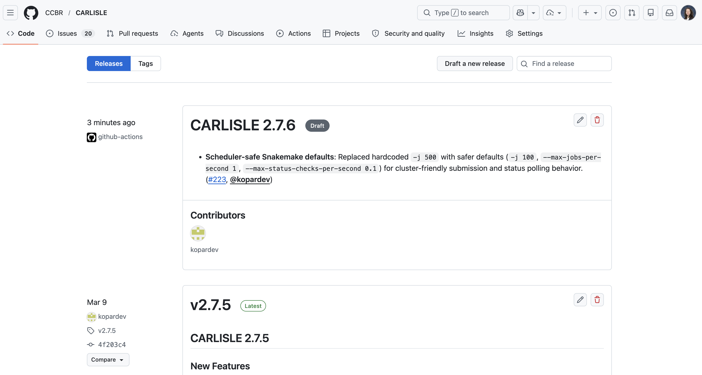
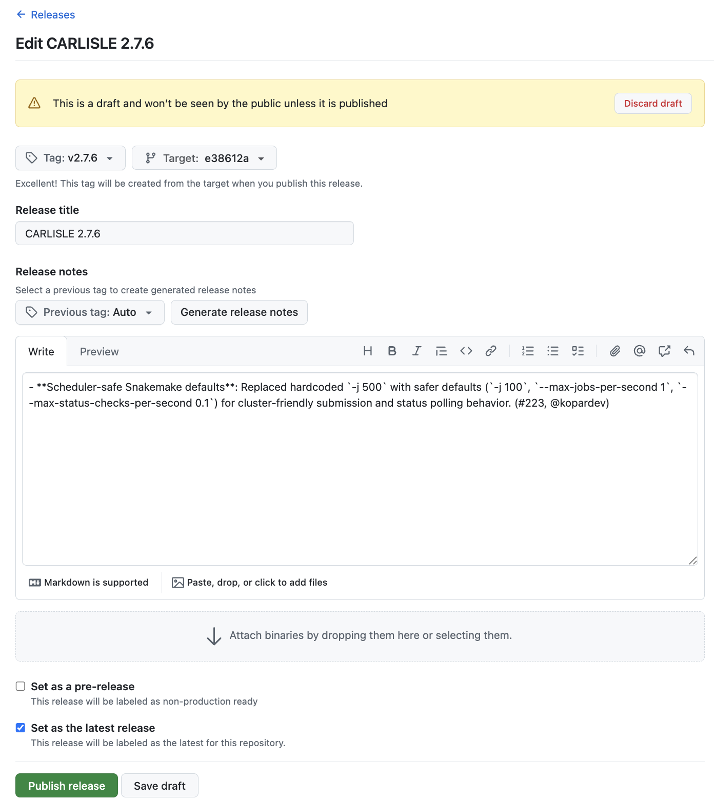
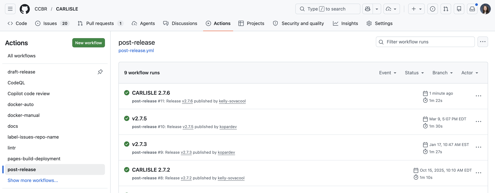
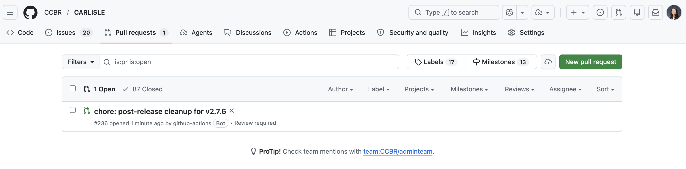
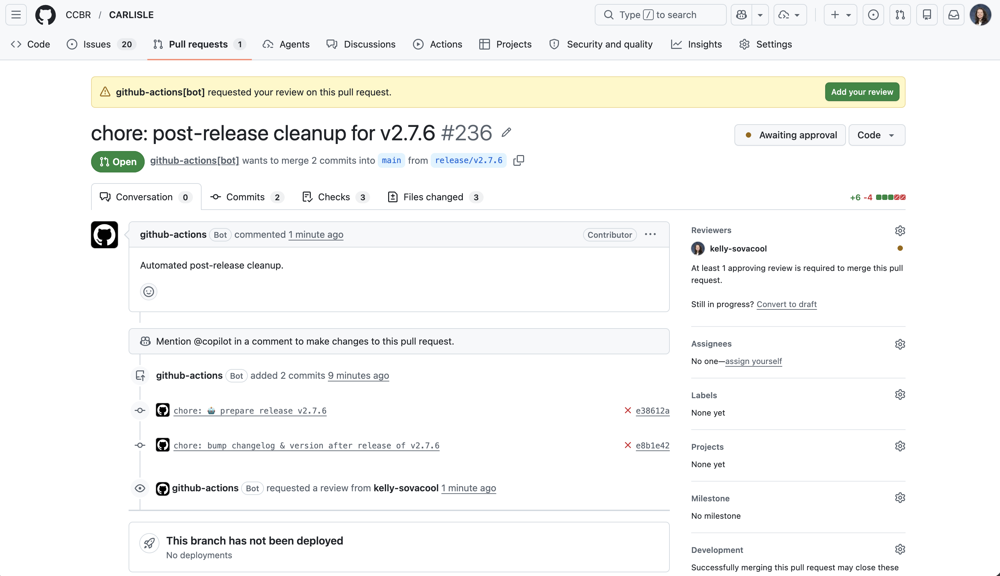
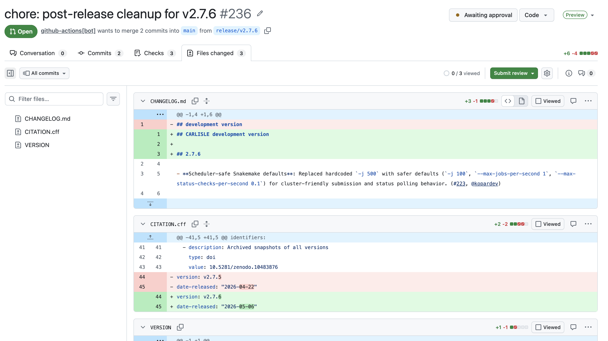
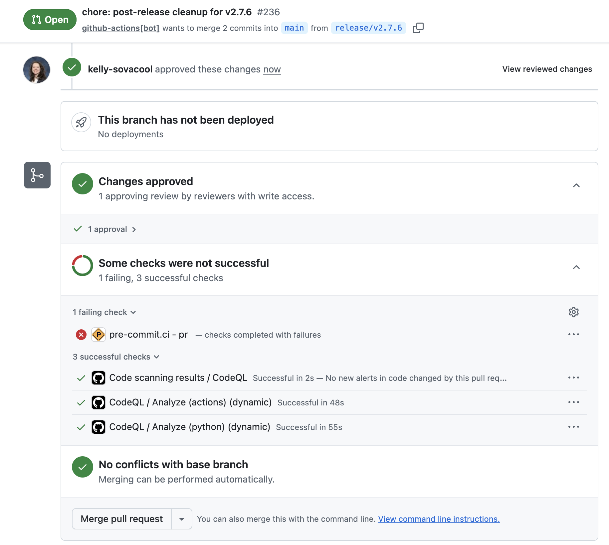
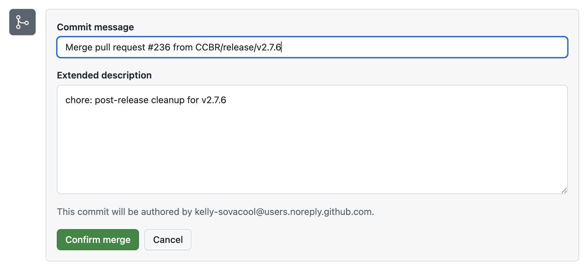

How to release new versions of our pipelines and tools using our semi-automated workflow.

## Ensure your repo has the following files:

  - [`CHANGELOG.md`](https://github.com/CCBR/CHAMPAGNE/blob/main/CHANGELOG.md) or [`NEWS.md`](https://github.com/CCBR/MOSuite/blob/main/NEWS.md)
    - The first header should be `## development version`.
    - Under the header, keep a bulleted list of user-facing changes & links to the PRs that added them.
    - If you don't have any entries under the development header, make sure you're updating the changelog with each PR that contains user-facing changes.
  - [`VERSION`](https://github.com/CCBR/CHAMPAGNE/blob/main/VERSION)
    - Containing only the semantic version.
    - If the version file is in a subdirectory, create a symlink at the repo root.
    - If your repo is an R package, you don't need this file because the version is in the [`DESCRIPTION`](https://github.com/CCBR/MOSuite/blob/main/DESCRIPTION) file instead.
  - [`.github/workflows/draft-release.yml`](https://github.com/CCBR/actions/blob/main/examples/draft-release.yml)
  - [`.github/workflows/post-release.yml`](https://github.com/CCBR/actions/blob/main/examples/post-release.yml)

## Run the tests on the development branch

  If you haven't already, run the test suite on the development branch.
  If your repo is a pipeline, use the test dataset/profile/configuration and
  make sure it completes without errors on Biowulf.
  If your repo is a Python or R package,
  the CI workflows should complete successfully in GitHub Actions.

  Do not cut a release if any of the tests fail.
  We only want to release working software!

## Run the `draft-release` workflow

  

## Once `draft-release` completes successfully, a new draft release will appear under the releases page

  `https://github.com/CCBR/<REPO>/releases`

  

  Click the pencil icon to edit the release.

  

  If everything looks good, scroll to the bottom and click "Publish release".
  This will trigger the `post-release` workflow to run, which will then open a
  Pull Request (PR) if it completes successfully.
  It should take < 2 minutes.

  

## Review the Pull Request opened by the `post-release` workflow.

  

  

  It will bump the version, changelog, and citation file to reflect the next
  development version.

  

  If everything looks good, approve the PR and merge the changes into main.

  

  

## Install the new release on Biowulf.

  You can skip this step if your pipeline/tool is not yet part of the ccbrpipeliner module.

  Log in to biowulf and start an interactive session.
  Load the ccbrpipeliner module:
  ```sh
  module load ccbrpipeliner
  ```

  Perform a dry-run of the installation:
  ```sh
  ccbr_tools install carlisle v2.7.6
  ```
  The dry-run will print the commands that it would execute for a real run:
  ```
  MAMBA_ROOT_PREFIX='/data/CCBR_Pipeliner/db/PipeDB/miniforge3/' && mamba activate /data/CCBR_Pipeliner/db/PipeDB/miniforge3/envs/py3.11-8
  git clone --depth 1 --single-branch --branch v2.7.6 https://github.com/CCBR/CARLISLE.git /data/CCBR_Pipeliner/Pipelines/CARLISLE/.v2.7.6
  chmod -R a+rX /data/CCBR_Pipeliner/Pipelines/CARLISLE/.v2.7.6
  chmod -R g+rwX /data/CCBR_Pipeliner/Pipelines/CARLISLE/.v2.7.6
  chown -R :CCBR_Pipeliner /data/CCBR_Pipeliner/Pipelines/CARLISLE/.v2.7.6
  pushd /data/CCBR_Pipeliner/Pipelines/CARLISLE
  rm -if v2.7
  ln -s .v2.7.6 v2.7
  chmod -R g+rwX v2.7
  popd
  ```

  If everything looks good, install it with `--run`:
  ```sh
  ccbr_tools install carlisle v2.7.6
  ```

  You can verify that the installation worked by reloading the module and
  checking the version of the pipeline/tool:
  ```sh
  module load ccbrpipeliner
  carlisle --version
  ```
  ```
  Pipeline Dir: /vf/users/CCBR_Pipeliner/Pipelines/CARLISLE/.v2.7.6
  Version: 2.7.6
  ```
